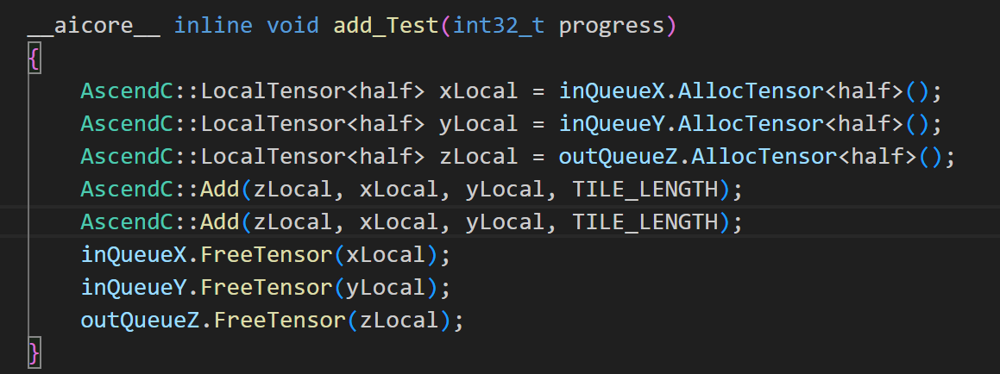
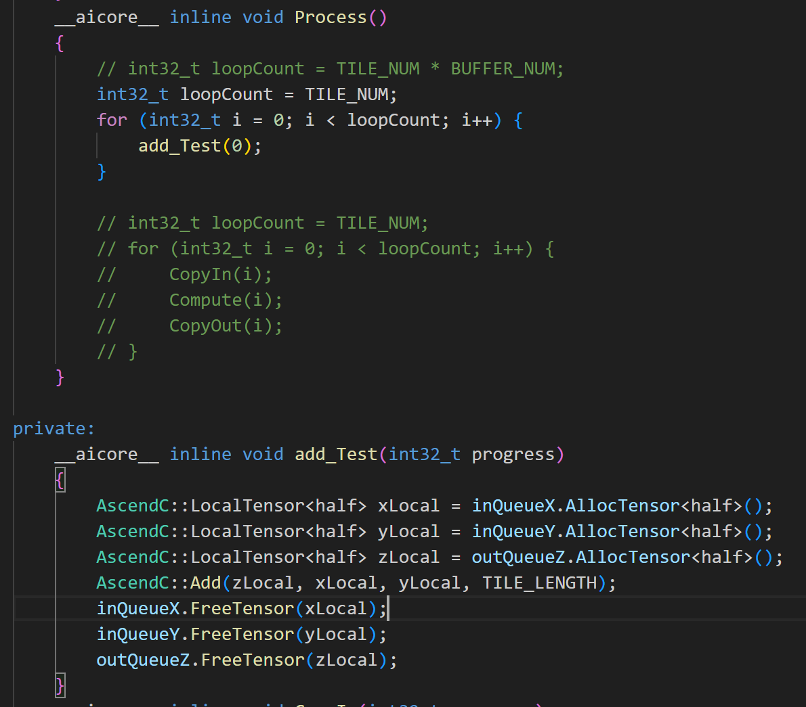
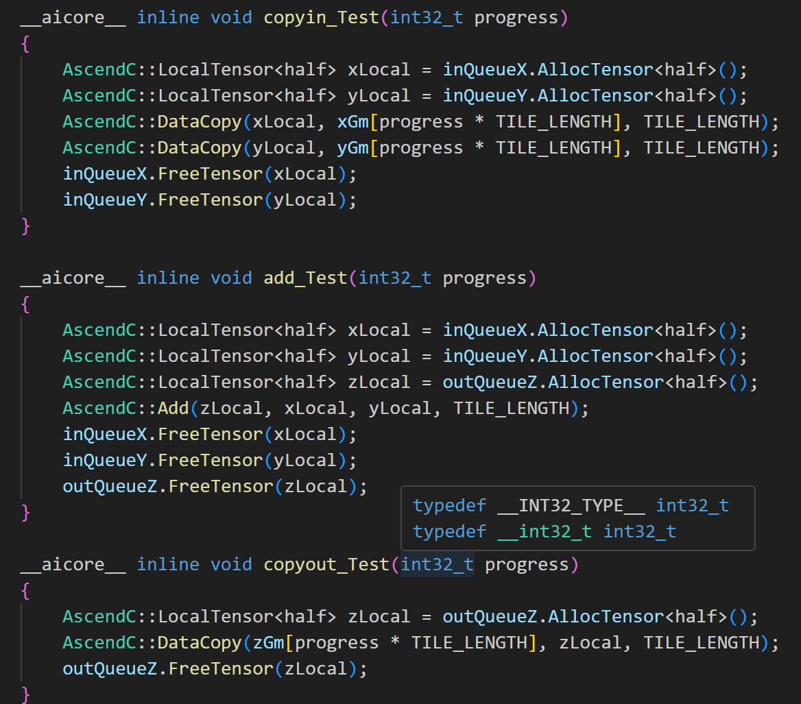
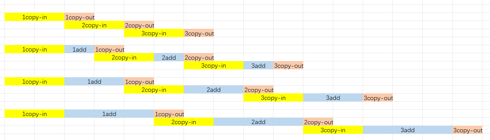
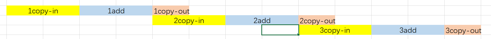
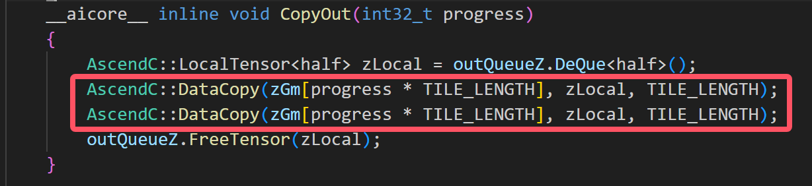
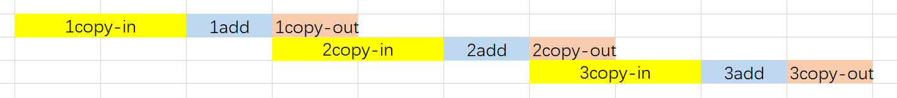
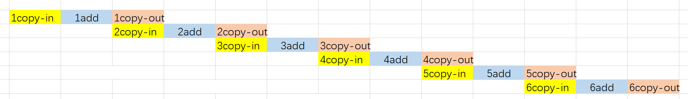
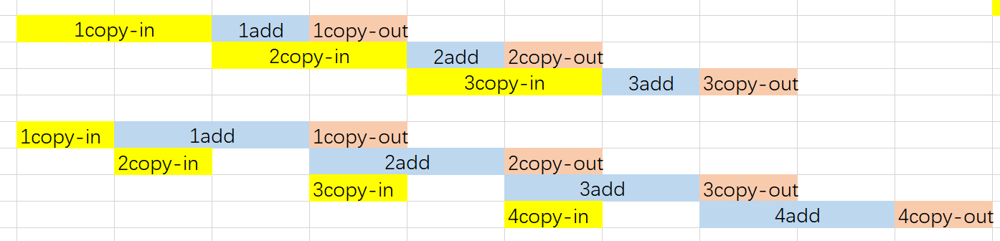
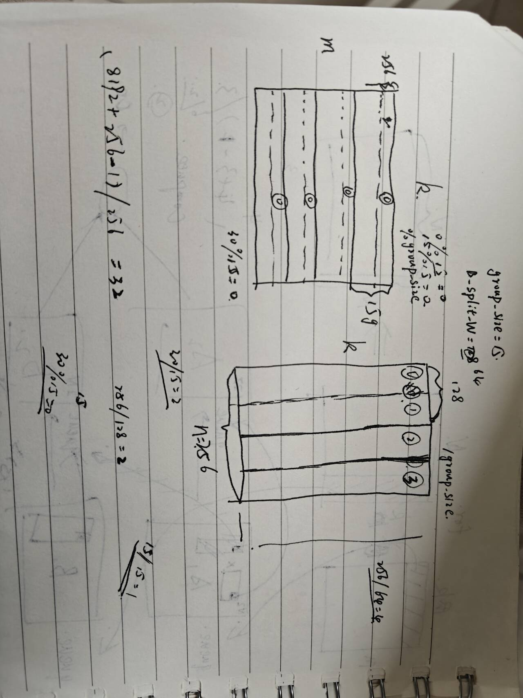

# 昇腾算子矩阵乘探究

## 编写昇腾算子完成矩阵乘

[点击查看相关简介](../../tutorial/ascend/mindspore_develop/readme.html)

## 使用add_custom算子验证流水线以及多缓冲

[原始数据.xlsx](./工作簿1.xlsx)

>!数据的长度限制在int32范围，因此我们采用2048\*64\*64\*64为上限；

>!同时需要注意的是，cache的容量为65536，而输入数据的大小为int16，因此，一次add支持的长度为2048\*16个int16

### 首先验证计算段远快于搬运段，同时证明流水

我们仅仅需要在compute阶段增加一个add函数

>!这个add函数仅仅执行一次add操作，不会改变任何数据，除了compute执行时间

two-add即：

|total_lenght|use_core_num|tile_num|buffer_num|tile_length|mean_time_100epoch(ms)|tip|
|---|---|---|---|---|---|---|
|2048\*64\*64\*64|1|64\*64\*8|1|2048\*8|31.8391|zero-add|
|2048\*64\*64\*64|1|64\*64\*8|1|2048\*8|41.581|one-add|
|2048\*64\*64\*64|1|64\*64\*8|1|2048\*8|51.2499|two-add|
|2048\*64\*64\*64|1|64\*64\*8|1|2048\*8|60.9961|three-add|

老实说，上面的时间相当微妙，如果按照正常逻辑，计算段的时间远低于搬运段，且满足流水，那么此处的时间应该相差不大，但是存在差距，而且不小，且每次增加的时间基本相等。

增加一个实验，仅进行相同次数的add操作，如下：

得到执行时间为9.7928ms

所以存在以下两种可能性：

+ 非流水，整个core func是串行执行

+ add执行的时间接近或高于2048*8个数据的搬运

再增加三个实验，即仅进行copyin、copyout、copyin+copyout

copyin执行时间为19.158ms

copyout执行时间为9.28448ms

copyin+copyout执行时间为19.523ms

以上数据能够完美的证明搬入搬出单元是独立的,以及x，y的数据搬运是串行的，得到以下流水图示：

还有一点在于，在执行freeTensor之前，我们没办法执行新的一轮搬运，这是因为我们的buffernum为1，否则无法满足上述理论模型。

因此，对于buffernum为1的情况，约束条件为，tile>=2的copyin需要在add之后执行，add的执行必须在copyout之后。

接着实验

### 单核下，成倍增加数据总长度

|total_lenght|use_core_num|tile_num|buffer_num|tile_length|mean_time_100epoch(ms)|
|---|---|---|---|---|---|
|2048\*64\*64\*8 |1|64\*64\*8|1|2048   |14.9771|
|2048\*64\*64\*16|1|64\*64\*8|1|2048\*2|18.1726|
|2048\*64\*64\*32|1|64\*64\*8|1|2048\*4|25.9916|
|2048\*64\*64\*64|1|64\*64\*8|1|2048\*8|41.5741|

当成倍增长总数据长度时，如果是串行，那么执行时间也应该线性增长，但是执行时间非线性，这可以侧面说明执行流程当中的流水。

对于增加数据长度，数据片数量不变而带来的时间增长，这个很好理解，虽然tile数量没变，但是tile_length在增长：

对于以上流程，其copyin以及compute决定了执行的总时间，验证copyout是否真的不影响总的执行时间，即在copyout中再执行一轮datacopy，如下：

得到的数据与上面表格对应的执行时间分别是14.9949，18.7419，27.2262，44.5016，基本不产生区别，可证。

### buffer num变化

|total_lenght|use_core_num|tile_num|buffer_num|tile_length|mean_time_100epoch_2buffer(ms)|mean_time_100epoch_1buffer(ms)
|---|---|---|---|---|---|---|
|2048\*64\*64\*64|1|64\*64\*8 |2|2048\*8|21.7073|41.5925|
|2048\*64\*64\*64|1|64\*64\*16|2|2048\*4|35.0148|51.8856|
|2048\*64\*64\*64|1|64\*64\*32|2|2048\*2|69.96  |72.5588|
|2048\*64\*64\*64|1|64\*64\*64|2|2048   |139.851|119.389|

随着数据片的数量增加，tile长度减小，时间损耗增大，如下图：

注意到同单缓冲数据相比，数据片长度分别为2048\*8，2048\*4，2048\*2的样例表现更好，但是当数据片更小时,反而表现更差，

采用以下图例进行说明：

当数据片较大时，充分利用到了double buffer，即在进行add的同时也能进行copyin，add无需在copyout以后执行，因此效果较好。

但是当数据片较小时，为什么double buffer的表现效果却比单缓冲的要差？关于这一点不能够理解。

### 多核

|total_lenght|use_core_num|tile_num|buffer_num|tile_length|mean_time_100epoch(ms)|
|---|---|---|---|---|---|
|2048\*64\*64\*64|1|64\*64\*4|1|2048\*16|36.8166|
|2048\*64\*64\*64|2|64\*64\*2|1|2048\*16|18.5086|
|2048\*64\*64\*64|4|64\*64\*1|1|2048\*16|9.35409|
|2048\*64\*64\*64|8|64\*32|1|2048\*16|4.97731|
|2048\*64\*64\*64|16|64\*16|1|2048\*16|3.17449|

实验符合预期

## matrix 验证

## 杂项

上面是分片，由上注意到，当B_Split_W为128，group_size为15时，根据代码，blockid=0，15，30的aicore会处理第0组数据，但是B矩阵仅被分了两组数据，因此blockid=30的aicore会轮空，也就是aicore-30实际上没有计算，其余aicore的计算负载增大，导致执行时间延长。