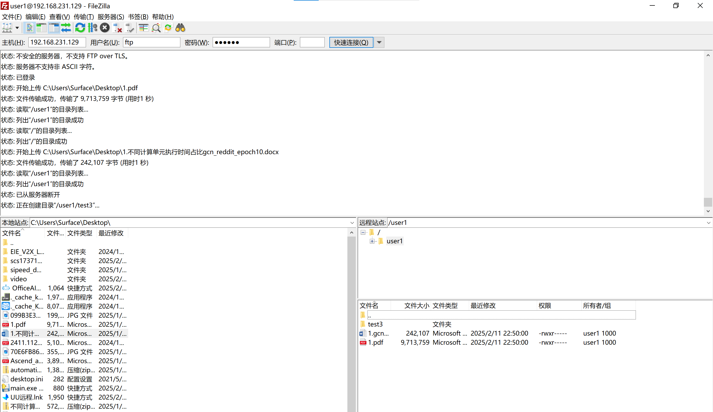
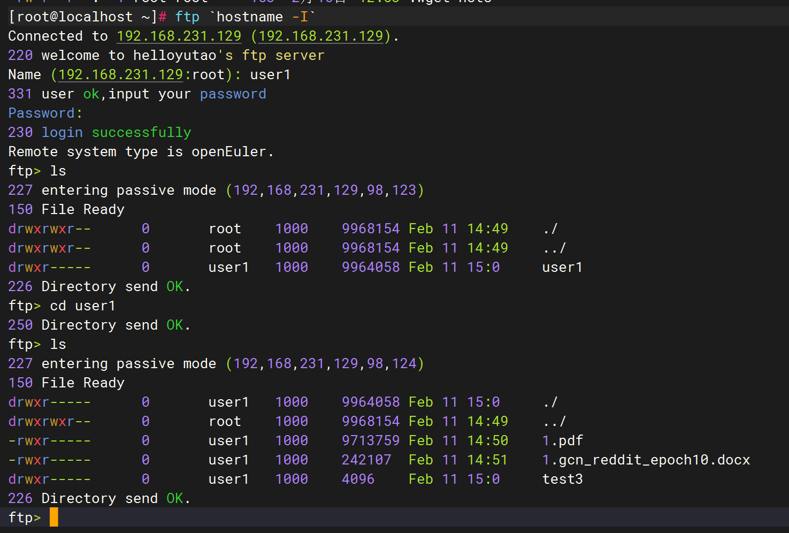
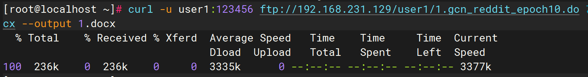
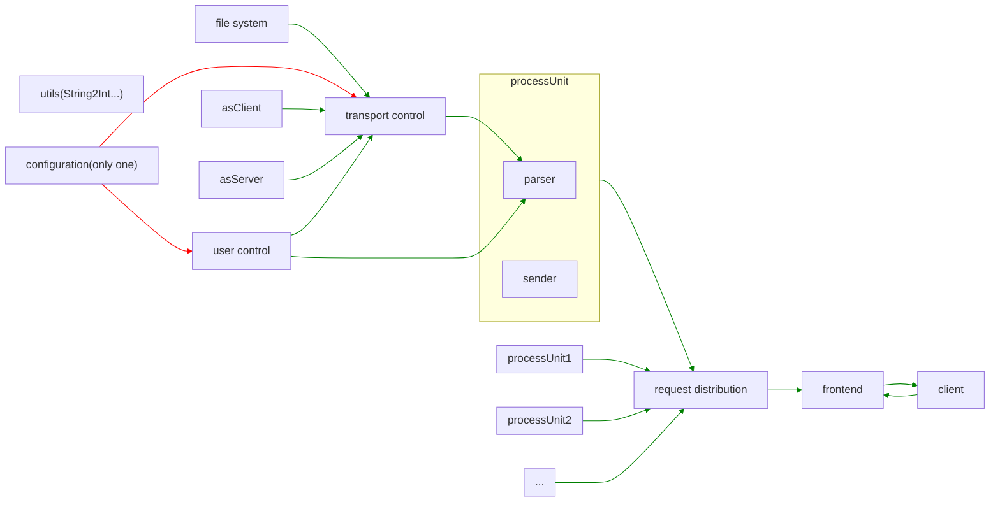

# openEuler应用软件开发赛+什么都不会+初赛+ftp服务器实现

> 支持被动模式避免客户端位于firewall或者NAT后面的情况
>
> 支持主动模式
>
> 整个项目完全使用仓颉语言开发
>
> 未使用任何开源项目
>
> x86_64/aarch_64

## run

+ server

    `bash run-ftp.sh`

+ client

    `dnf install ftp`

    `ftp 127.0.0.1`
    
内置用户

|user|password|
|---|---|
|ftp||
|user1|123456|
|user2|123456|

可用协议指令

|inst|参数|用途|
|---|---|---|
|"USER"|username|登陆用户|
|"PASS"|password|登陆密码|
|"SYST"||查看系统信息|
|"PORT"|port|使用客户端端口设置主动模式|
|"LIST"||列出目录文件|
|"CWD" |path|切换目录|
|"PWD" ||查看当前路径|
|"PASV"||设置被动模式|
|"TYPE"|mode|设置传输格式|
|"RETR"|file|下载文件|
|"STOR"|file|上传文件|
|"MKD" |file|创建文件夹|
|"ABOR"||流产连接|
|"QUIT"||退出|
        
## 效果

+ filezilla


+ ftp


+ curl


## 整体架构



## 并发架构

+ 资源池方案

    将操作系统资源抽象为池，当出现新的用户请求时，从池中取出资源进行分配

    在本项目中的实现即为，使用request Distribution（reqdist）模块解耦业务逻辑与用户请求

    新的请求进入时，reqdist模块将会分配新的线程用于处理当前的请求，当请求断开时，释放线程资源回到池中。因此所有占用的资源都是可限制的，我们可以预设线程数以限制访问的qps，防止某些不安全攻击操作。

    [可扩展]解耦的好处是，我们能够轻易的扩展其余硬件，例如，当服务器不止一个cpu（或者其他协处理器）时，线程资源分配将会复杂化，我们仅需要在reqdist模块中将资源分配给process unit，而不必考虑具体的业务逻辑。

+ 资源锁

    多个线程对文件的变动将有可能产生资源冲突。

    我们最小化公共资源，将所有对实际文件的操作都聚集在configer模块当中，因此我们使用configer改变文件状态时，将会使用锁解决访问资源冲突问题。

    同时对资源进行精细化控制，以便平衡时间与资源同步的问题。

## 权限管理

+ 文件系统

    为了实现足够精细化的权限管理，我们手工实现了一个简单的文件系统，仿照linux文件系统的inode设计，下面是一个文件夹的inode结构体，使用json文件存储inode列表。
    ```json
    {
        "name": "/",
        "type": "d",
        "user": "root",
        "user_power": 7,
        "group_power": 7,
        "others_power": 0,
        "subfiles": [
            0,0,1,2
        ]
    }
    ```
    文件的id取决于文件inode在json array中的index

+ 权限

    我们的权限系统依然仿照linux，user_power代表用户（创建者）本身的权限，group_power代表组用户的权限，others_power代表其他用户的权限。
    组用户取决于config.json文件中user group，如下
    ```json
    "user1":{
        "password":"123456",
        "group":["ftp"],
        "root":1
    }
    ```
    例如上面的user1信息中，ftp默认用户是其组用户成员
    权限数字分别代表三位数字的bool值，当第一位为1，也就是100时值为4，代表有下载查看权限，当第二位为1，也就是010时值为2，代表有下载权限，剩余一位留作扩展。

+ tip

    **既然每一样都跟linux类似，为什么不直接用linux的文件系统？**
    > 因为我们对项目的要求是可扩展性，如果直接使用linux的文件系统，如果我们以后需要扩展其余权限，例如更改文件的权限，删除文件的权限，我们的扩展就会非常困难。

## 数据传输

### 主动模式

主动模式下，需要客户端告知服务器端口

因此服务器需要作为客户端连接用户机，此时无需考虑端口的问题。

### 被动模式

被动模式下，需要服务端告知客户端数据端口

此时服务器作为数据传输的服务器等待客户端连接。

服务器需要扫描服务器上的可用端口告知客户端以连接。

+ 端口池

    秉持所有资源皆可控的理念，我们将端口也作为配置放入配置文件，端口作为资源为客户端分配，达到可控的方式。

    **假设我们采用临时扫描端口的方式，那么不得不考虑的问题是，在扫描到空闲端口后，但是该端口实际上属于service所使用的端口（出现暂时空闲），在扫描到确认连接这段时间内，该端口有可能被重新占用的问题。因此我们的方案既避免服务占用ftp端口的情况，也避免ftp占用服务端口的情况，同时减少代码开发代价**

## source 

[download](https://atomgit.com/openeuler123/nihaopeng)