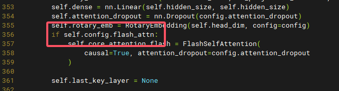
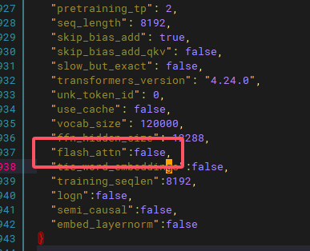

# telechat-12B移植

## 从hf mirror下载模型
别问我为啥不在hf官网，梯子流量够用随便搞
+ download hfd,a tool to download base on aria2
`wget https://hf-mirror.com/hfd/hfd.sh`
`chmod a+x hfd.sh`

+ 设置hugginface下载环境变量
`export HF_ENDPOINT=https://hf-mirror.com`

+ 下载模型
`./hfd.sh Tele-AI/TeleChat-12B --tool aria2c -x 4`

    >出现报错看下面的教程

+ 下载数据集（用于记录，不用执行）
`./hfd.sh wikitext --dataset --tool aria2c -x 4`

## aria编译
如果你跟着上面的步骤走，那一定会到这里，因为yum源没有aria2安装包，乐

+ 克隆aria2源码
`git clone https://github.com/aria2/aria2.git`

+ build
`autoreconf -i`
autoreconf装了运行不了，缺少autopoint
    + yum install gettext-devel

装依赖

`yum install openssl-devel zlib zlib-devel`

`./configure ARIA2_STATIC=yes`

error:A compiler with support for C++11 language features is required.
    + solution:yum install g++

`make install -j4`

## git-lfs编译

如果你跟着上面的步骤走，那一定会到这里，因为git-lfs妹有riscv64版本的，蚌

+ 安装go

`yum install golang`

+ 编译

1,克隆git-lfs
2,`go env -w GOPROXY=https://goproxy.cn`
3,添加bin目录到环境变量
4，执行`git lfs install`

## openeuler-riscv上编译pytorch

+ 依赖
`dnf install python3-{hypothesis,psutil,pyyaml,requests,sympy,filelock,networkx,jinja2,fsspec,packaging,numpy,venv}`

+ 下载gitee预编译riscv-whl

`git clone --recursive https://github.com/pytorch/pytorch`约4个GB，建议用梯子

`cd pytorch && python3 setup.py develop`

+ 测试
<div style="text-align:center;"></div>

## 安装transformers
`git clone https://github.com/huggingface/transformers.git`

>下面这句逆天操作据说是ninja和cmake互相依赖导致无限递归的问题，乐
`dnf install cmake python3-devel`

安装rust compiler(逆天)
`export RUSTUP_DIST_SERVER=https://mirrors.ustc.edu.cn/rust-static`
`export RUSTUP_UPDATE_ROOT=https://mirrors.ustc.edu.cn/rust-static/rustup`
`curl --proto '=https' --tlsv1.2 -sSf https://sh.rustup.rs | sh`

`pip install 'transformers[torch]'`

## 运行python inference
+ 问题1：需要安装flash-attn，然而该库依赖cuda支持
修改12B模型中的modeling_telechat.py的357，增加config中的flash-attn判断以取消初始化FlashSelfAttention类产生错误，如下图：

<div style="text-align:center;"></div>

记得修改config中的参数

<div style="text-align:center;"></div>

+ 修改虚拟环境中.venv/lib/python3.11/site-packages/transformers/generation/utils.py用以显示进度
<div style="text-align:center;"></div>

推理脚本如下：

```python
import os
import torch
from transformers import AutoModelForCausalLM, AutoTokenizer, GenerationConfig
tokenizer = AutoTokenizer.from_pretrained('../models/12B', trust_remote_code=True)
model = AutoModelForCausalLM.from_pretrained('../models/12B', trust_remote_code=True, torch_dtype=torch.float16)
device = "cpu"
model.to(device)
generate_config = GenerationConfig.from_pretrained('../models/12B')
question="你好！你是谁？"
answer, history = model.chat(tokenizer = tokenizer, question=question, history=[], generation_config=generate_config, stream=False)
print(answer)
```

`python3 test.py`

## huggingface转为onnx
`pip install optimum[exporters]`

[下载12B模型](#从hf-mirror下载模型)

[修改推理模型](#运行python-inference)

运行以下脚本转换为onnx格式
```python
import os
import torch
from transformers import AutoTokenizer, AutoModelForCausalLM
import onnx
import onnxruntime as ort
import numpy as np

os.environ['TRANSFORMERS_OFFLINE'] = '1'

class ModelWrapper(torch.nn.Module):
    def __init__(self, model):
        super().__init__()
        self.model = model

    def forward(self, input_ids, attention_mask):
        # 显式传入 use_cache=False，确保不使用 past_key_values
        outputs = self.model(input_ids=input_ids, attention_mask=attention_mask, use_cache=False)
        # 只返回 logits，以避免复杂的输出结构导致的问题
        return outputs.logits

def export_model_to_onnx(model_name, output_path, opset_version=13):
    tokenizer = AutoTokenizer.from_pretrained(model_name, trust_remote_code=True)
    model = AutoModelForCausalLM.from_pretrained(model_name, trust_remote_code=True)
    model.eval()
    model.config.use_cache = False

    text = "This is a sample input for ONNX export."
    inputs = tokenizer(text, return_tensors="pt")

    # 用包装器替换原始模型
    wrapped_model = ModelWrapper(model)
    wrapped_model.eval()

    input_names = ["input_ids", "attention_mask"]
    output_names = ["logits"]
    dynamic_axes = {
        "input_ids": {0: "batch_size", 1: "sequence_length"},
        "attention_mask": {0: "batch_size", 1: "sequence_length"},
        "logits": {0: "batch_size", 1: "sequence_length"}
    }

    # 导出为 ONNX
    torch.onnx.export(
        wrapped_model,
        args=(inputs["input_ids"], inputs["attention_mask"]),
        f=output_path,
        input_names=input_names,
        output_names=output_names,
        dynamic_axes=dynamic_axes,
        opset_version=opset_version,
        export_params=True,
        do_constant_folding=True,
    )
    print(f"模型已成功导出到 {output_path}")

def validate_onnx_model(model_path, model_name, text):
    tokenizer = AutoTokenizer.from_pretrained(model_name, trust_remote_code=True)
    model = AutoModelForCausalLM.from_pretrained(model_name, trust_remote_code=True)
    model.eval()
    model.c
```

## onnx使用hhb转为二进制可执行文件


## 利用npu加速执行
目前（2024-12-11）openeuler暂不支持npu。

2025-3-12, 当前使用openeuler24.03 sp1，已支持npu

手动挂载驱动，如下：

```bash
insmod /lib/modules/6.6.0-72.0.0.76.oe2403sp1.riscv64/kernel/drivers/soc/xuantie/nna/img_mem/img_mem.ko.xz

modprobe vha onchipmem_phys_start=0xffe0000000 onchipmem_size=0x100000 freq_khz=792000

insmod /lib/modules/6.6.0-72.0.0.76.oe2403sp1.riscv64/kernel/drivers/soc/xuantie/nna/vha/vha_info.ko.xz

chmod a+rw /dev/vha0

lsmod
```

此时/dev文件夹出现vha0

