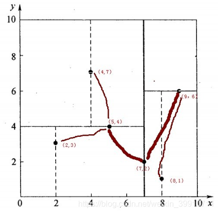
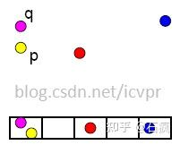
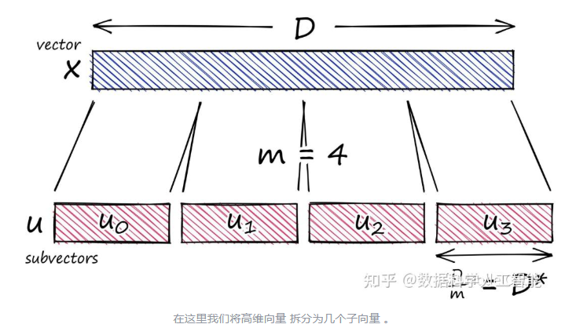
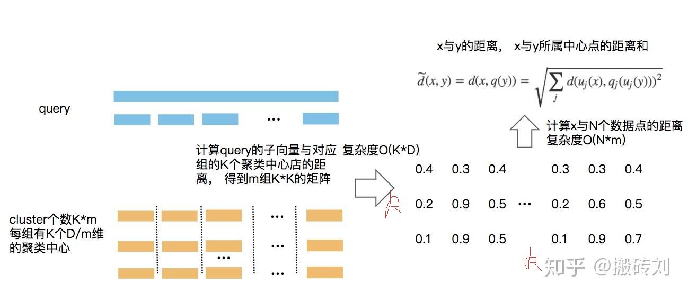

# ANN（Approximate Nearest Neighbor）近似最近邻算法

ANN是KNN的弱化版本

近似最近邻检索的核心思想：搜索可能是近邻的数据项而不再只局限于返回最可能的项目，在牺牲可接受范围内的精度的情况下提高检索效率。

## 基于树的方法
KD树是其下的经典算法。一般而言，在空间维度比较低时，KD树的查找性能还是比较高效的；但当空间维度较高时，该方法会退化为暴力枚举，性能较差，这时一般会采用下面的哈希方法或者矢量量化方法。

k-d树是一种空间划分树，说白了，就是把整个空间划分为特定的几个部分，然后在特定空间的部分内进行相关搜索操作。想一个三维(多维有点为难你的想象力了)空间，kd树按照一定的划分规则把这个三维空间划分了多个空间，经典的分治思想，类似归并排序（和八叉树?，老实说，这几种树，貌似都是平衡树的一种，将数据划分以减少计算量）

举一个多个数据点构造kd树的例子，划分结果如下图：

**注意（7，2）为根节点，此时出现一个新点需要计算最近邻时，从根节点出发，位于根节点右边则进入（9，6）节点，避免了原始算法O（n）的计算复杂度，关于kd树的其他知识则是增删改，不再赘述。**

## 局部敏感哈希（LSH）
核心思想：在高维空间相邻的数据经过哈希函数的映射投影转化到低维空间后，他们落入同一个吊桶的概率很大而不相邻的数据映射到同一个吊桶的概率则很小。在检索时将欧式空间的距离计算转化到汉明（Hamming）空间，并将全局检索转化为对映射到同一个吊桶中的数据进行检索，从而提高了检索速度。这种方法的主要难点在于如何寻找适合的哈希函数。

**简而言之，假设我有n个点，我将这个n个点分散到m个桶内，分的方法使用hash函数，然后查询新点时，再通过同样的hash func计算属于哪个桶，将桶内数据取出进行线性匹配（挨个计算距离）。以上理论成立的前提是，通过该hash func，邻近的点真的能进入同一个桶，那么hash func的挑选就成了该算法的核心。**

> 汉明空间即计算汉明距离，是比较两个长度相同的向量，若某个维度相等，则距离加一，汉明距离可以比较两个二进制串，a=11101010，b=11011010。a和b两个二进制串不同的位数为2，则汉明距离为2。相似度越高，距离越小。

对于传统的hash，上面的每个“桶”内只能装一个值避免冲突达到O（1）的复杂度，LSH则是将相邻的放在同一个桶。

## 矢量量化
其代表是乘积量化（PQ）。它的主要思想是将特征向量进行正交分解，在分解后的低维正交子空间上进行量化，由于低维空间可以采用较小的码本进行编码，因此可以降低数据存储空间 。

**PQ**的简单概要：选取一个大向量，将其拆分为子向量，将每个子向量分配给其最接近的质心值，并将质心值替换为其唯一ID，生成一个较小的ID向量。

在该过程结束时，我们将高维向量（需要大量内存）简化为需要很少内存的ID向量。

假设向量长度 为为12。我们首先将此向量拆分为 个子向量，如下所示：

PQ方法采用基于查找表的非对称距离计算(Asymmetric Distance Computation，ADC)快速求取特征向量之间的距离，在压缩比相同的情况下，与采用汉明距离的二值编码方法，采用ADC的PQ方法的检索精度更高。

**fine，fine，上面太复杂了，不过严谨的论述不能少，下面是不严谨的，先讲矢量量化，就是kmeans的结果有k个簇，例如256个簇，那么我可以用8bit表示完这256个簇，这个8bit所对应的值就是cluster_id，我们需要找簇时通过8bit来找，而不是原数据u，达到压缩数据的作用。**

**PQ干嘛呢，就是在划分前先将d维向量划分成m份，在m份中单独做聚类，这样能并行化聚类的过程，m份中有k个簇，这k个簇两两之间计算距离，可以得到一个$m*k*k$的码本，这个后面查询的时候用**

SDC

x是query向量，首先计算q（x），就是x的聚类中心，然后计算q（y），y是向量库里的向量（cluster id），所以问题被转化为计算聚类中心之间的距离，而计算聚类中心的距离可以直接查码本，也就是上面提到的。

ADC

ADC是非对称的，也就是x直接与q（y）计算距离，只有一个量化误差。但是显而易见，在线计算，没法查表，性能有所下降。

用以上两种算法去求query的近似数据。

上述方法在m份聚类组中都要进行，最后得到一个欧式距离的总和，就是x与y的距离。

## 基于图索引的方法（文献总结）

和树很像，但不是一个东西，比如说a向量和b向量可以指向同一个相近向量，这一点在树结构中是不存在的。

