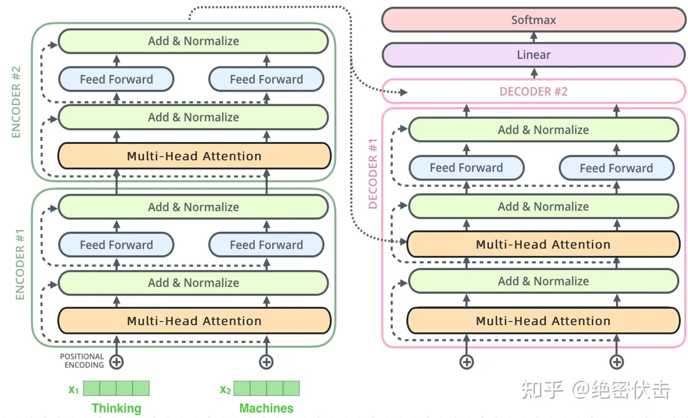
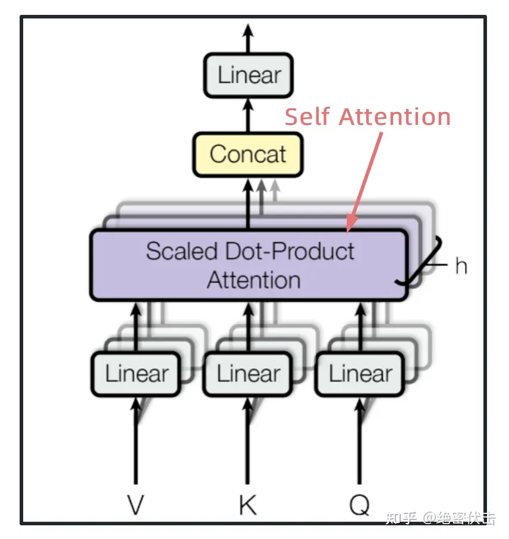

# transformer

## 整体结构
整体

细节

## 流程

简述一下

+ 1，输入一句话，如“how are you”
+ 2，将这句话进行词向量嵌入，每个单词转换成一个m为的向量，这句话中有3个词，所以最终输入的矩阵维度就是3*m。
+ 3，将词向量与位置编码直接相加，然后输入encoder，一层层encoder向下传
+ 4，将最后一层encoder的结果输入给每一层的decoder，再一层层计算decoder的值，并向下传递，最终输出一个词向量矩阵，然后查词典得到对应的自然语言
+ 5，需要注意的，对于这个结构而言，我们是一次性将所有的单词进行输入，而非像传统时序网络那般，每一个编码/解码器负责一个向量输入，这样对于整个网络更能注意到整体的信息，而无需像lstm那般设置很多的门来避免信息丢失，这也更符合人理解自然语言的流程。

## self-attention

只需要知道是计算qkv相关矩阵，基本是矩阵运算，不用深入原理，说不清的。

通过多头注意力计算得到输出，然后输出进行拼接，然后输入linear，如下：

## 其他

ADD && NORM就是残差连接再归一化，都好理解，前者避免linear信息丢失，后者避免输出爆炸

需要注意的是decoder中的第一个多头用的masked：

第二个多头中的KV用的是encoder的输出矩阵计算得到的。

Feed forward层就是一个非线性层，现在这些概念都快绕昏了，mlp，linear，dense，ffn一大堆。