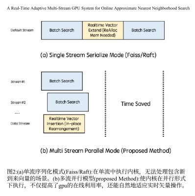
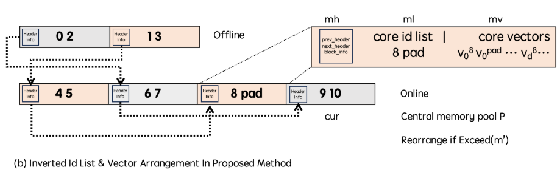
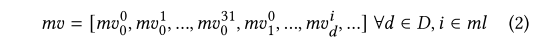
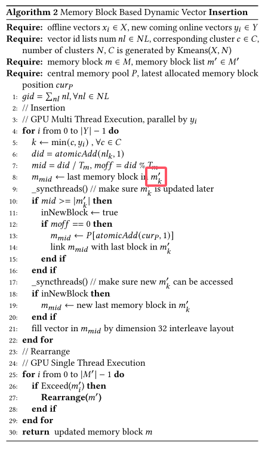
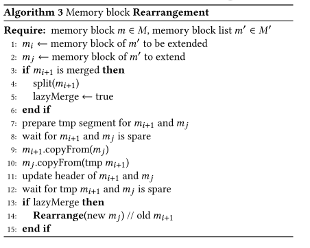
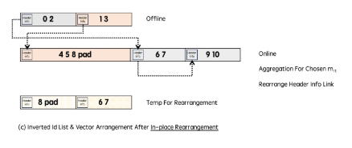
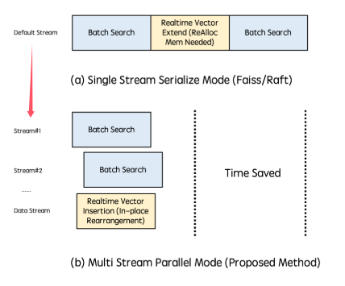

# A Real-Time Adaptive Multi-Stream GPU System for Online Approximate Nearest Neighborhood Search

---

> 解决在线场景中需要实时插入的问题。

## main problem

+ 1，在线场景实时插入

+ 现有系统对ANNS采用单流串行执行模式：如下图上部分：

当进行实时向量扩展时，批处理需要进行阻塞，如果复制的数据量大，等待期延长，导致搜索过程被阻碍。

+ 同时，触发向量扩展时，需要GPU启动kernel来进行内存分配和复制，这个过程是耗时的。

## solution

### CPU/GPU ANNS中的在线向量插入方法

+ 首先改变了数据结构改为链表（如上图），现有系统将所有的向量连续的排列在内存当中。header info的内容报头包含指示prev_header、next_header和block_info的地址的重要信息（向量容量、向量大小等）。ml中记录的是这个簇中属于这个block的vectorid。mv被以32维交错的放在内存块中（？）如下图，D是单个向量的维度。

+ 设计新的内存分配方式，就是加了一个内存池管理，内存池的大小是整个主存的大小。然后将内存按块分为最小单位，

直接看看它的算法吧，老实说，看不太懂，就对于上面的伪码而言，k是从哪里冒出来的？文中似乎并没有提到这一点，我们就假设代指全部。同时忽略需要同步的代码，仅看代码逻辑。

那么当需要插入一个新向量时：
+ 1，计算向量列表的末尾索引did
+ 2，通过did计算应该放在哪个block，blockid为mid，还需要该向量在block内的偏移moff才能准确定位（吐槽一下，$T_{m}$又是哪来的？）
+ 3，如果mid大于已分配的block list，那就分配新的block，注意到嵌套if，第一个if查看是否需要插入新的block，第二个if判断是否是第一个元素，才选择从内存池中新分配block，这里需要强调的是，为什么这么做呢，别忘记了整个函数是一个gpu核函数，此时其他线程也在操作。原子化的判断，不会使其余线程也同时加入新block造成冲突（精彩）
+ 4，后续就是更新$m_{mid}$，然后将新的vector写入block。
+ 5，如果新加入的block list的长度超过预定义的$T^{'}_{m}$,那么执行重排操作。

重排操作（严重吐槽，这还是个递归函数，关于函数的解释就两句话？？，图也没有一个，不确定正式发表是否有改动，我要是reviewer包给他挂了）：

言归正传，其实主要思想就是，我们不是新加入了一个block，上图中是$m_{j}$,我们这个新block可能和旧列表中的向量是连续排列的，因此需要将$m_{j}$放到$m_{i}$后面，那么就交换$m_{j}$和$m_{i+1}$，交换需要中间空闲临时块。

那么产生的新问题是，交换过去的$m_{i+1}$也可能和旧列表中的块邻近，因此采用递归操作知道收敛。这里的递归终止实在是看不懂了，merge是在干嘛是真不知道。

后面才注意到还有个图c，甚至论文里面没有引用过，如下：

### 流缓存多流执行

如上图，将多个执行核放到多个流上。
这样做有两个问题要考虑
> 1）系统必须避免联机内存分配和解除分配，以防止全局阻塞和降级为串行化机制。2)系统中的每个内核都不应消耗大量资源，因为过多的资源消耗会导致阻塞。

总结就是由于存在共享资源，所以会有锁的问题，一旦多个流同时访问同一个资源，那就会由并行转为串行执行。

对于问题1：
> 设计了一个双层的基于流的资源池。最初，每个批量搜索请求被分配给一个专用流，拥有单独的小内存分配（足以使用ivfflat和ivfpq算法）。

之前提到内存池大小是整个内存，这里就是为每一个搜索流单独分配一个足够使用的内存空间。这样就不会和实时插入流产生冲突。
如果不够用了，再从中央内存池分配空间。

## deployment detail
实际使用的系统，（虽然文章让人很不爽，但是能用起来的都是牛逼方法）
直接看原文描述：
> 我们的系统已经在T4/A10 GPU机器上运行了六个多月，无缝集成到一个广泛使用的信息应用程序的搜索和推荐系统中，每天有超过1亿用户。包括两个基本部分，即离线和在线组件，我们的系统有效地管理准备好的数据和实时矢量插入任务。离线段专用于处理准备好的数据，而在线段编排实时向量插入操作

> 在线段由多个CPU线程管理，并与Kafka接口进行消息摄取，它实现了一个动态的队列策略，在将聚合的批次分派给GPU之前，每秒或在达到128次插入的倍数的阈值时聚合向量，上限为1024。在内核执行之前，我们仔细地从资源池中分配了32个独立的资源，每个资源都配备了50 MB的缓存内存，如前所述。在临时内存需求超过此阈值的情况下，额外的内存将从中央池中获得，每个分配设置为200 MB。为了确保公平的资源分配，特别是在高QPS条件下，我们设计了无锁队列机制。当所有32个资源用尽时，请求被拒绝。此外，我们为载体插入任务建立了专用流，以简化处理。

实际执行算法时有一些细节还是需要注意，不算是trick，只能说作者没在method里面提到过，但是很重要。

**高地址分配策略进行搜索，低地址插入。**（看不懂，原文就这一句，乐）

