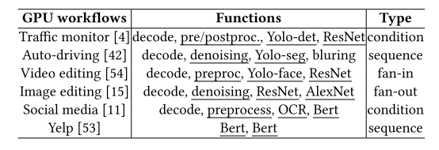
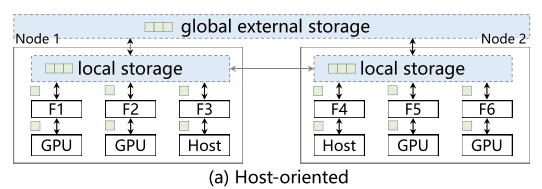
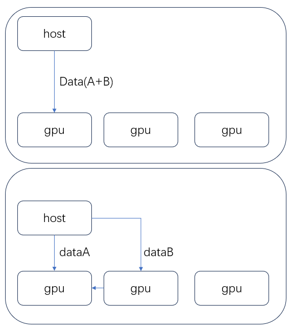
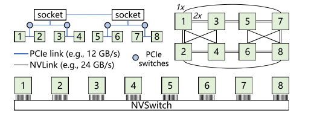
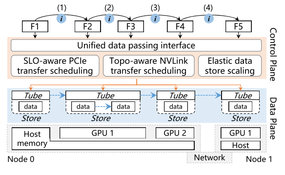
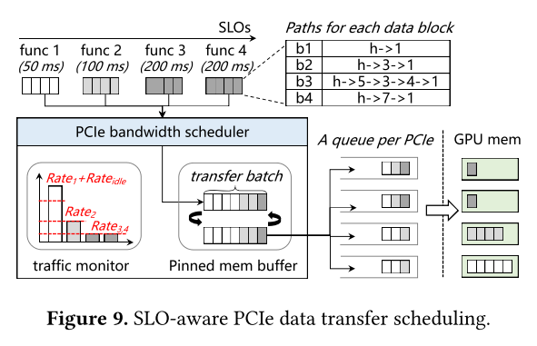
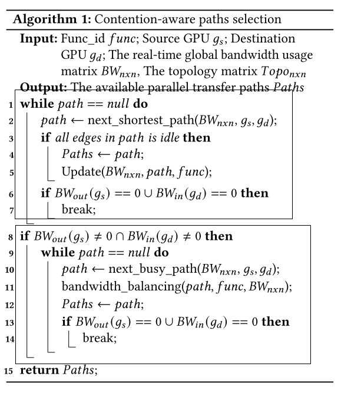
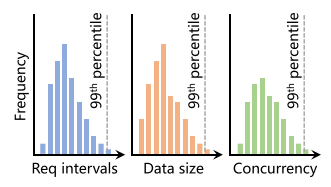
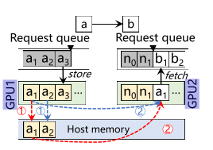

# FaaSTube: Optimizing GPU-oriented Data Transfer for Serverless Computing

推理应用程序通常将多个模型和操作缝合到一个工作流中。这个是本文的前提，因为存在这样的工作流，因此在任务进行的过程中存在大量的数据transfer，这会造成大量的时间开销。

无服务器推理工作流涉及各种类型的数据传递。除了典型的cFunc（cpu函数）到cFunc数据传递之外，还有主机到gFunc（gpu函数）（其中主机表示主机内存中的cFunc或I/O数据）和gFunc到gFunc数据传递。不幸的是，当前的无服务器系统依赖于面向主机的数据传递方法

如上图，对于gpu到gpu的数据传输，首先将数据复制到host，然后再复制到gpu，忽略了nvlink的存在；而对于host到gpu，则采用单个PCIe链路，而忽略了gpu间存在的PCIe链路。如下图，将需要传输的data拆分，分别传输（并行）。

faastube作为数据传输的透明管道，用户不必操心传输的问题，就是开了一个抽象层，用户直接用其抽象层提供的api进行数据传输。

总结存在的第一个问题就是，现有的工作都是单点传输，即传输数据的时候使用一条PCIe总线通路，而没有考虑复杂系统中多条PCIe通路的利用，以及提出相应算法来利用gpu间PCIe的拓扑关系最大化传输效率。

第二个问题是，现在长时间运行的如ML任务，现有的内存管理系统会占用大量的内存，且临时分配内存会带来数据传输延迟，因此提出一个内存池方案，用以缓解内存压力。

## 解决问题1

各种拓扑链接如上图，私以为，除开右上角的链接方式，其余部分不太能够利用到gpu间的传输链路。

>! 论文中提到，G1-G4可以通过G4-G6-G7加倍带宽（?），这个数据通路不是很符合逻辑（看不懂）。以及后面提到的，G3-G7通过G3-G2-G1-G7以及G3-G4-G6-G7提高带宽，这个可以理解。

FaaSTube提供统一的数据ID，以简化管理主机端存储（例如，共享主机内存，Redis服务器）和GPU端存储（例如，CUDA IPC句柄）

也就是说该系统将数据进行封装，类似于“页表”机制?为每个页维护一条信息，可以传递这个页的id以获取地址信息。在文中，也就是一个tube，如下图。与页表机制相同，采用多级页表映射机制，这是由于内存空间很大，如果要保证内存划分的细粒度，那就必须要建立多级映射以维护页表。

论文中还提到，数据的复制采用流水线的方式进行，但我并没有看到任何关于流水线的说明。

关于数据传输的带宽控制，论文中提到将全局带宽抽象成整体来分配，如下图，每一个函数的data transfer会被划分为块来进行传输。

PCIe bandwidth schedular中计算$$Rate_{least}=data_{size}/(L_{slo}-L_{infer})$$(最小传输需求)$$L_{infer}$$代表推理计算延迟。SLO代表服务等级目标（serverless的一些专业知识，不是很了解），然后注意到还有一个循环固定缓冲区，类似于双缓冲机制，提前分配两块固定大小的缓冲区，两块缓冲同时使用，一块用来缓存需要传输的数据，另一块用来传输数据，也类似流水线的方式，提高传输效率。

FaaSTube利用并行NVLink路径来增强非统一拓扑中的点对点数据传递。FaaSTube引入了一种竞争感知路径选择算法，可优化NVLink使用，同时最大限度地减少来自其他功能的带宽竞争（避免路径重复）。给定无服务器工作流，FaaSTube首先应用MAPA 中的放置策略将函数分配给GPU，并最大化函数之间的NVLink连接。在确定功能布局后，FaaSTube首先在无服务器工作流中包含的GPU之间分配直接连接路径。如果这些直接NVLinks已经被其他函数占用，FaaSTube将强制其他函数释放路径并重新规划其他路径。

上面那个挺难理解的，直接看他抽象到最上面的算法，1-7行就是搜索空闲路径，然后将空闲path放入paths列表。如果找不到空闲路径，且输入输出带宽没有耗尽，那就搜索忙碌的路径，将占用这条忙碌路径的函数和当前需要路径的函数比较，如果不平衡，且占用当前路径的函数能够切换到另一条路径，那就将该函数挪到另一条路径，当前函数占用该path，这个过程看上去似乎比较复杂，因此作者强调了该过程在实验中仅花费10微秒。

## 解决问题2

1）在每个GPU上提供了一个自动伸缩的内存池，可以根据功能的实际需求弹性伸缩，2）基于请求队列智能地在主机和GPU内存之间迁移数据。

当函数工作负载和中间数据大小动态变化时，这种方法会导致内存占用高达我们实验中实际需求的4倍。虽然PyTorch允许手动回收内存池，但它会回收所有内存块，从而在未来的分配中引入开销。最近的工作，GMlake ，通过使用CUDA虚拟内存和统一的2MB内存块来减少内存池中的碎片，但它仍然缺乏弹性内存回收。此外，GMlake中每个块上昂贵的IPC操作在数据传递中引入了大量开销（在我们的实验中高达45 ms）。

原本keep-alive策略根据每个函数的请求间隔定义函数停留时间，也就是该函数所分配的内存需要维持的时间，但是对于本文所解决的工作流的场景，每个函数的中间数据大小也在波动，因此该波动仍会引起以上提到的问题，因此引入了三个变量用来计算保留的内存大小，如下图：

    

f分别是请求间隔（$R_{window}$），中间数据大小($R_{size}$)，以及数据积累度($R_{con}$)，内存保留计算为 $Data_{size}=R_{size} \cdot R_{con}$ ,内存池的最大大小为 $MemPool_{size}=\sum_{func}Data_{size} \cdot 1_{ {R_{window} \bigcap t \neq 0} }$。

    

如上图，对于函数a，其请求数据a1由于先入队，所以先出（LRU策略），但是b1需要用到a1，但此时a1已经被复制到主机，b1还需要重新加载数据而带来延迟，因此faastube优先将a2这种不再使用的数据复制到主机（如何知道是否使用?），并且清除不再需要的中间数据，在有足够内存时，将先前迁移出去的数据再迁移回来，以避开transfer的高峰。

