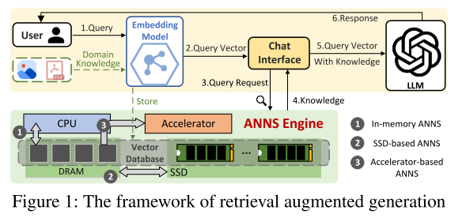
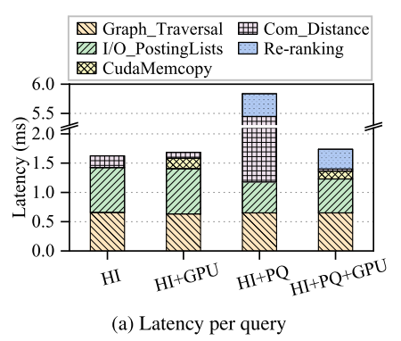
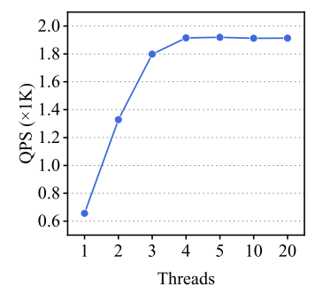
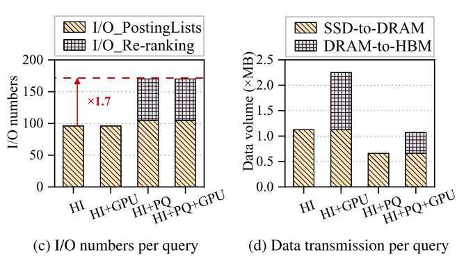
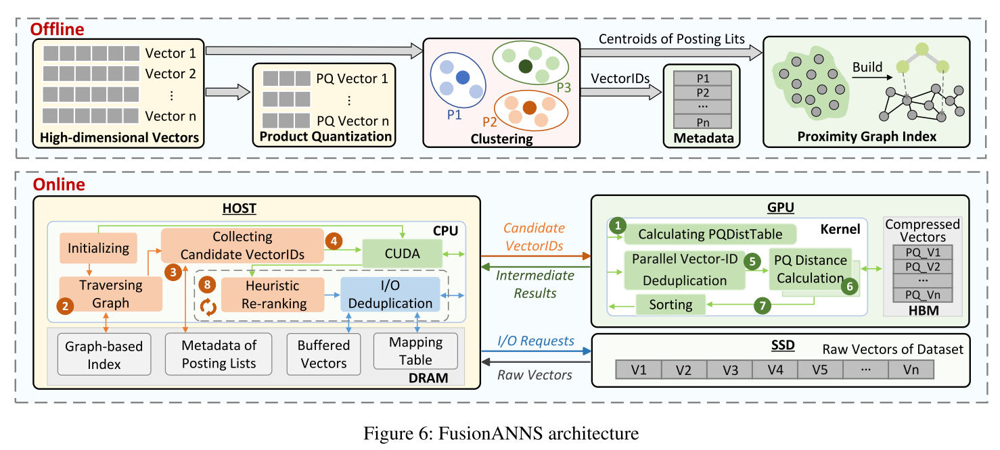
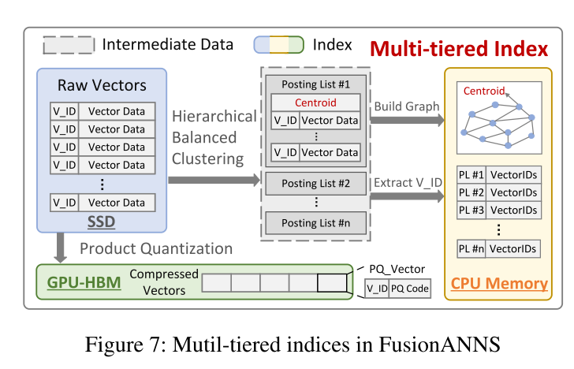
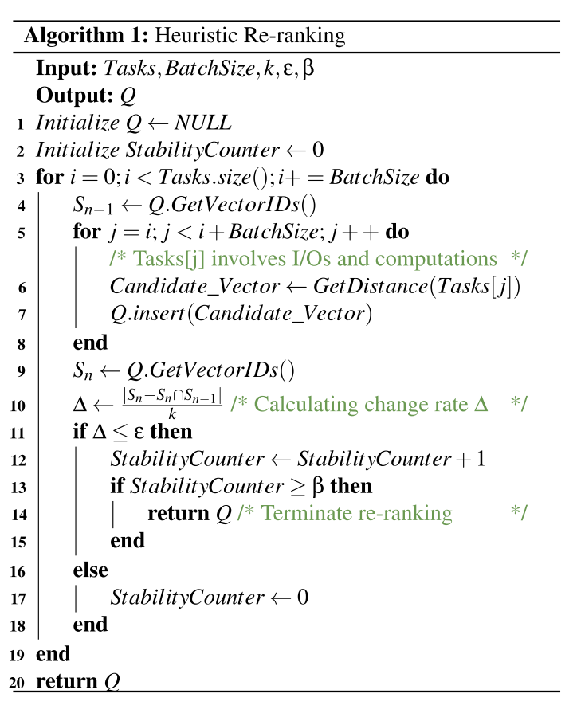
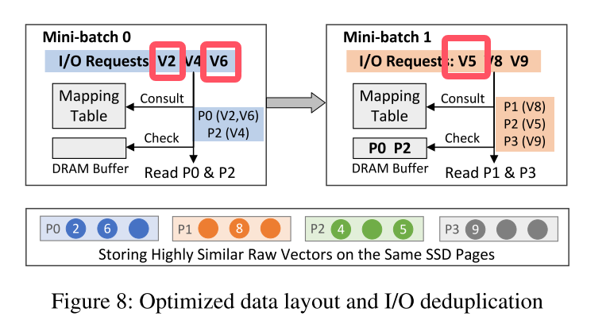

# FusionANNS: An Efficient CPU/GPU Cooperative Processing Architecture for Billion-scale Approximate Nearest Neighbor Search

---

## RAG

上图为RAG框架，首先将领域知识作为高维向量嵌入到向量数据库中。当聊天机器人接收到查询时，它使用ANNS引擎从向量数据库中检索最相关的知识，从而允许LLM将该知识用作额外的上下文以进行更准确的推理。*事实上，我认为该框架更符合AGI的发展方向，如今人工智能的发展过于依赖神经网络的万能拟合，而忽略了严谨知识，我们应该理解的是，先验知识被训练作为NN中的参数具有一定的不可控性，比较明显的证据就是大模型的幻觉。神经网络应该作为逻辑推理模块而非一个知识库（?）*。

> 提到的IVF（inverted file），是直接对所有的向量进行聚类，然后将查询向量同聚类中心计算距离，取最近的前topk个簇，然后遍历计算簇下面的向量。

文章认为IVF占用了大量的内存资源，同时PQ是一种有损压缩，准确率不高。而如果直接使用gpu加速基于IVF的SPANN，性能甚至比原来下降10%，根本原因是数据的大量迁移。

## ANN
关于ANN的知识点详见[ANN](../../algorithms/ann/ann.html)

ANN中有三种常见的方法，kd树，在论文中称为分层索引；乘积量化，结合矢量量化使用；局部敏感hash；论文中还提到了使用GPU加速技术，但将这些方法集和起来使用发现比微软的SPANN性能要差。

> *直观地说，可以将分层索引、乘积量化和GPU加速技术结合起来，以实现最佳的ANNS解决方案。然而，我们发现，这些技术的组合导致甚至比SPANN更差的性能，它只利用层次索引（第2.3节）。总的来说，在GPU加速的ANNS系统中，将分层索引与产品量化合作仍然存在一些挑战。*

对于spann，其qps不随线程增加而增大，在4个线程就达到了最大值，且不再增大，也就说硬件资源的增加不影响算法的效率，从软硬协同的角度这显然阻碍了效率的提升。

文章探究了其原因，测量了每个ANNS查询平均所需的I/O数量以及跨SSD、主内存和GPU HBM传输的数据量。如图c所示，虽然PQ技术显著地将发布列表的I/O大小从12 ‐ 48 KB减少到了页面粒度（4 KB），但由于重新排序过程，它将I/O数量增加了70%。因此，I/O性能瓶颈从固态硬盘的带宽转移到每秒输入/输出操作数（IOPS）。此外，CPU和GPU之间会传输大量的发布列表，从而抵消了GPU加速带来的好处，如图d所示。

也就是数据传输的频率提高了，每个数据传输请求之间的转换是存在开销的。

## 存在的三个挑战

+ 1，为了提高查询的准确性和效率，大多数ANNS系统采用复制策略来构建高质量的IVF索引，其中边界向量被复制到相邻的倒排列表中。这可以显着扩展索引的大小，比原始向量大8倍。即使这些索引使用PQ压缩，GPU的HBM仍然无法容纳所有压缩的索引，导致GPU和CPU之间的大量数据交换。

+ 2，由于PQ会造成不小的准确性损失，因此通常将其与向量重排序过程相关联以提高查询准确性。然而，由于在不同的压缩向量之间准确度损失显著地变化，因此确定在给定的准确度约束下对于每个查询需要重新排序的向量的最小数目是具有挑战性的。

+ 3，由于原始向量（128 〜 384字节）远小于现代NVMe固态硬盘的最小读取粒度（4 KB），因此每次请求原始向量都会导致读取放大，从而导致重新排序期间的I/O效率较低。(不是很能理解这个，按道理，即使是向量，在主存中也应是顺序存储，这与读取粒度的关系是什么?也就是说，虽然原始向量只有128字节，但是一次可以读取多个向量?受到影响的应该仅仅是最后向量的读取。)

## solution

先看fusionANNS的架构图(非常清晰的图，很值得学习)：

离线部分略过，讲讲在线部分，当有一个查询向量时，
+ 1，gpu生成距离表用于PQ计算（?）
+ 2，cpu查询前m个最近的倒排列表，就是前m个距离最近的质心，因为涉及排序，所以放在cpu（?存疑），排序也可以放在gpu来着。
+ 3，查询元数据，因为上面拿到的是质心，需要获取质心所属簇的向量用来计算距离。
+ 4，cpu传输这些向量到gpu
+ 5，PU接收到向量ID时，它首先使用并行hash模块删除重复数据。（更像是相近的归为一组，仅保留一个数据）
+ 6，GPU从HBM中读取相应的压缩向量，并计算它与查询向量之间的PQ距离。就是求查询向量与PQ得到的码本中的距离之和。
+ 7.取计算得到的前n个id。
+ 8，cpu使用启发式重新排序机制（?）
+ 9，re-ranking，返回前k个邻居，在这个阶段采用冗余感知i/o消除重复i/o。

看看详细设计

上图中可以看到，首先将原始的vector数据通过分层平衡聚类算法聚类成n个list，每个list中就是每个簇的向量数据，将这些簇构造为图，并将图和簇内向量复制到主存。（图索引的构建方法：该图是通过不断向空图添加新的向量来构建的。将向量添加为新顶点时，将创建新边以将此新添加的顶点与其top-k(通常为)最近的相邻顶点连接起来。然后，其相邻顶点应更新其最近的邻居以限制最大边数。）

后文提到了一个提高聚类质量的方法，我们focus on efficiency，所以不做赘述。

到这里，丢弃掉中间发布列表，仅保留上图所示的主机内存中的内容，到这里该系统在通用服务器上能够支持十亿规模的ANN。

同时注意到图下方的PQ矢量被存储在HBM当中。将所有压缩向量固定在HBM，避免了cpu与gpu大量的数据交换。（到这里，存在的一个疑惑是，原本的系统是如何处理这些数据的?为何之前的系统没有这样做?）

由于内存中的索引仍然保留了边界向量复制机制的优点，FusionANNS可以有效地获得候选向量的所有ID，然后将这些向量ID（不包括向量的内容）发送到GPU进行距离计算。通过这种方式，FusionANNS还消除了CPU和GPU之间有限的PCIe带宽造成的性能瓶颈。

后文提到：
> SSD上的原始矢量。与基于IVF的SPANN将所有发布列表存储在SSD上不同，FusionANNS只需要将原始向量存储在SSD上以进行重新排名。由于原始向量的体积几乎是倒排列表的8倍，FusionANNS可以显著降低存储消耗。对于每个查询，由于只有重新排序过程会产生少量I/O请求，因此FusionANNS还可以缓解并发查询的SSD I/O瓶颈。

我不是很能理解，我非常好奇原本的系统难道不是这么做的吗?或者是将所有的原始向量都加载到主存??

### 重排机制

该机制是用以提高PQ带来的准确率降低（?），将重排化为多个小批处理（batch）按顺序执行，这样可以达到一旦重排不再有利于准确率就立即停止重排，提升效率。

> 由于所有候选向量都以其距离升序排序，因此较早执行的小批量通常具有更高的可能性来识别属于最终前k个最近邻居的更多向量。一旦一个小批处理完成，我们利用一个轻量级的反馈控制模型来检查后续的小批处理是否有利于提高查询精度。

轻量级反馈控制模型依据以下公式：$$\Delta=\frac{|S_{n}-(S_{n} \bigcap S_{n-1})|}{k}$$

$S_{n}$和$S_{n-1}$分别是第n批和第n-1批向量id集合。k表示需要得到的前k个向量，也就是维护的max heap的向量数。这个公式的意义也就是向量的变化率，如果变化率连续$\beta$次小于阈值$\varepsilon$，那就终止重排。（显然，公式计算时间可以忽略。

看看上述过程的伪码，仅做个参考，抽象层级太高了。总结一下就是，按批处理数据，在每个批次中更新大端堆，当一个批次更新完后，看看是否停止重排。

### 冗余感知i/o接口

到这里，前面提到的SSD细粒度问题得到解决，那就是之所以会产生细粒度不匹配问题，也就是单个向量过小（>=128k），而SSD访存单位为4k的这个问题，是因为在上述过程中，每次访存只访问一个向量，见算法1.

因此对于上面的过程会面临大频率的i/o请求，带来效率降低。

> 虽然需要重新排序的向量是通过PQ距离获得的，但它们都与查询向量高度相似，这使得它们通常在空间上彼此接近。这种相似性提供了通过仔细组织SSD上的数据布局来减轻读取放大的机会。

> 具体来说，当离线创建内存中索引时,对于导航图中的每一个质心，我们使用桶来存储最接近质心的多个原始向量。我们注意到，在桶之间没有重复的向量。对于每个桶，如果它不与SSD页面对齐，我们使用最大-最小算法(?)基于未对齐部分的大小组合联合收割机桶，以最小化SSD页面上的可用空间。最后，我们将所有桶分组为单个文件并将其存储在SSD上，并使用内存中的表来维护向量和SSD页面之间的映射。

似乎以上方法仅仅是将每个簇分文件存储以达到并行访问的目的?但似乎没什么意义，因为每次查询仅访问单个向量，此处没办法采用并行策略。

以下是i/o重复数据删除机制：

原文已经讲得十分清楚，这里贴一下原文：

> 其中小批量0的任务是重新排序向量：V2、V4和V6。mini-batch 1的任务是对向量V5、V8和V9重新排序。当执行mini-batch 0时，它首先查询映射表以获得与所请求的向量相对应的SSD页面ID。由于V2和V6都存储在同一个SSD页面P0中，因此我们可以合并这两个I/O请求，只读取一个SSD页面以获得V2和V6。由于P0和P2不存在于DRAM缓冲区中，我们通过两个I/O请求直接将它们读取到DRAM缓冲区。在小批量1中，尽管V5、V8和V9被存储在不同的SSD页中，但是DRAM缓冲器已经包含P2，P2包括V5。因此，mini-batch 1只需要通过两个I/O请求读取P1和P3。

其中提到的合并v2和v6作为一个i/o请求，但并未提到其实现方法，dram缓存和这篇论文貌似没啥关系?这是SOC中已经非常成熟的cache设计，不再赘述。