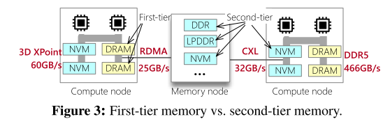
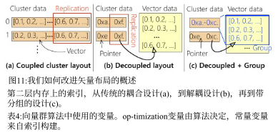

# Characterizing the Dilemma of Performance and Index Size in Billion-Scale Vector Search and Breaking It with Second-Tier Memory
---

本文较特殊，前半部分花费了大量篇幅论证了在当前的存储下，图索引以及聚类索引所面临的困境，这一大部分内容对阅读造成了困难，因此后续分析将进行简略处理。

提到的二层存储是使用RDMA和CXL连接的远程DRAM/NVM（非易失性存储）。

## main problem

> 对于一个64核的商品化的服务器，使用SIMD在100-384维的公共向量数据集上搜索，效率可以达到3624-5212 Mvectors/sec。
>
> 但是对于5.3GB/s带宽的固态硬盘，即使带宽利用率拉满，也仅仅能支持14-53Mvectors/s的向量查询效率，这个差距也就是存储墙的问题。

因此这里武断地说，如果不改变查询向量的系统结构，类似于fusionANNS那样，那唯一的解决方案就是降低i/o请求频率，如何解决呢？cache！乐，实际上就是类似于内存到三级缓存那样处理，如果一个数据之前被取过，那我不必再去发起新的i/o请求，这一点在fusionANNS中有提到过类似的解决方案。

论文又提到在fusionANNS上提到的问题，SSD访存颗粒度不匹配问题。

> 我们认为，第二层存储器-易失性或非易失性（NVM）存储器通过快速互连（如RDMA和CXL （§4））连接到主机，为系统地解决这个问题提供了机会。具体而言，这些设备的行为类似于存储，但支持更精细的访问粒度（256 B vs. 4 KB），这与向量索引的工作负载模式相匹配。此外，它们对于具有甚至更小访问粒度的随机读取（例如，100 B）

其实就是如果直接访问SSD，那单次请求的颗粒度大小为4KB（或许与文件系统的BLOCK相关），但是使用RDMA或者CXL这种类总线的间接访问方式可以降低其粒度以减少i/o请求的开销（存疑，虽然粒度减小，但是请求次数没变，二层内存是否能够带来更高的访存效率？）。

主要问题：

> 我们将这种困境归因于高性能SSD访问的I/O需求与具有小索引放大的矢量索引发出的I/O工作负载之间的不匹配。
> 图索引需要细粒度的存储读取来实现实际的索引大小。对于具有最小索引大小的实用图索引，我们必须用每个节点的少量边来构造它。从算法的角度来看，这意味着图遍历必须使用具有小有效负载的随机I/ o来读取这些边。但是，这与使用足够大的I/O有效负载(4 KB)以有效利用SSD等传统存储设备的要求存在根本冲突。

文章用了大量篇幅论证上面的观点，论证过程不再赘述。

## solution
再看看图索引的实现：

其中节点是向量，边连接距离近的向量。例如，如果a → B，这意味着向量B是a的前k向量。提到的辅助搜索的压缩图是什么（?，查：质心代表簇中的向量数据，每个节点的邻居数有参数配置的k相关，不是查询使用的那个top-k。

下面是在图上寻找前k个最近向量的流程，思路很简单，不再赘述。

图索引的缺点：
>由于其指针追逐访问模式，导致长延迟和低带宽利用率。此外，图索引对向量插入不友好，因为构建图需要重建图。

聚类索引（也可以叫簇索引，只是名字不同，其本质是一种量化方法）：

基于簇索引的方法中需要注意的是不平衡划分问题以边界问题，边界问题在fusionANNS中提到，在此处更加明了，解决方案是将边界向量复制到一组关闭的集群，其中复制的数量在索引构建之前静态配置。下图可以说明该问题：

如果top-c质心仅包含cluster0，那cluster1中的邻近向量就被丢掉了，导致准确率降低，解决方法就是将cluster1中的边界向量复制到cluster0，缺点显而易见，存储代价增加。另一种解决方案就是将两个cluster都读一遍，也可以获取到所有的邻近向量，但是缺点也很明显，搜索代价增加。

看看一层存储与二层存储的结构图：

优点是（1）老一代内存更便宜，（2）间接允许通过池化未使用的内存来提高内存利用率。

然而，它们仍然比DRAM慢得多，并且表现得更像存储，也就是说单次i/o请求的延迟比直接dram要慢得多，特别是RDMA（究其原因是经过的流程太多了，cpu向DMA发送请求，DMA接受请求处理完transfer后触发中断，等待中断执行），那解决方案显然是将单次i/o请求内容增大（术语叫请求载荷）。

常用的十亿规模的数据集（仅做个记录）

**文章的主要方法就是借助二层内存（二级内存？），在该内存上构建图索引和聚类索引，借助二层内存更细粒度的访存，我们可以加速向量查询，以上说法不是很精准，因为借助RDMA以及CXL等中间传输介质，不能将二层内存直接看做内存**

### 基于second-Tier Memory改进的图索引

+ 软件流水线
很简单，就是使用异步i/o，（虽然不算惊艳，但是是非常稳健的方法）
> 我们提出了一种软件管道机制，用计算来异步处理I/O，从而最大限度地利用计算能力。
RDMA中使用协程（就是一个用户级的多线程，可以理解为在多个函数之间来回调度，但是不通过os kernel，这么说可能有点抽象，你可简单理解成用户自己实现的多线程），NVM和CXL中使用预加载（mm_prefecth），能理解的，类似于操作总线，我们通过store/load指令访存，但是该操作无法实现异步，由于是cpu指令，需要强制同步等待，所以论文也提出了重新组织指令顺序（术语：乱序执行）。

+ 压缩图布局
呃呃，因为是图，邻接稀疏矩阵，所以转为csr存储，就酱。。

### 基于second-Tier Memory改进的聚类索引

+ 解耦索引布局
如上图，a图为原始的布局，对于边界向量，是直接将向量复制到各个簇当中，显然浪费空间。b为解耦布局，将向量地址和向量数据分开存储，这样边界向量的占用就被减小了。（注意，此处不要将二层内存看作内存，实际存储设备仍然是SSD，二层内存是一个抽象，借助它的细粒度以及异步i/o我们可以做到加速）。

那么新问题是，如何在新布局上执行搜索，先查询向量地址，再用向量地址读取数据（小负载），（这里有一个大前提，还记得前面各设备延迟对比么，那就是SSD的访问延迟是75微秒，而二级内存的延迟低得多，平均在个位数以下）。

+ 集群感知分组

基于以上方式产生的新的问题是，该方式将原本的单个数据访问解耦后，产生了起码两倍的i/o数量，怎么解决？

又是非常精彩的cache优化（万物皆可cache，悲）。

仍然见上图，

> 通过将属于同一集群的向量分组在一起，并将它们存储在相邻的存储中，我们可以使用一个大I/O来读取所有组中的向量（地址）

注意到，虽然我们可以一次读取一个聚类所有的数据地址，但是别忘了还要读取数据，如果这个聚类中存在边界向量是由其他聚类复制过来的，那么我们就需要一个单独的i/o请求来访问该向量（读到这里，你肯定疑惑，都有地址了，为啥要单独访问该向量？别忘了，我们用的二层内存是RDMA这一类“介质”，每次的请求是一个连续的地址块，精彩）

所以引出了后续的工作，怎么分组？假设有一个向量数据库，有一组向量V，和一组聚类C，使用$P_{i,j}$表示向量i是否被分配到一个组（应该是不与同聚类其他向量不在一个组的意思，否则后边儿的公式说不通），$h_{j}$表示聚类的接入频率（访问频率，后台监测得到），所以问题用公式表述如下：
$$minimize \sum_{j}^{|C|}h_{j} \cdot (1 + \sum_{i}^{|V|}P_{i,j})$$

以上问题使用整数线性规划（ILP）解决，（简单认为是动态规划，毕竟背包问题就是用ILP解决），论文没讲具体实现，针对不同场景，该算法可以千差万别。

聚类约束：

ok，$A_{i,j}$哪来的？似乎论文里面没有提到过。

组约束：就是每一个向量必须分配到最少一个组。

ok，看后文，似乎他们并没有给出实际的ILP解决方法，而是用贪心策略

> 观察问题的简单结构，我们可以使用简单的贪心算法来寻找最优解。具体来说，对于一个已经被复制到多个聚类的向量，将其分配给访问频率最高的聚类是最优选择。这是因为，非正式地说，将其分配给访问频率较低的集群会增加I/ o的数量。

## interesting phenomenon
在常规的开发中，图索引有更小的存储占用，不需要太多边就能达到高精度，但是高频率的i/o访问带来性能瓶颈。
而聚类索引的访问模式更适合SSD的粗粒度访问，性能更高，但精度不足。

但在本文的实验中，恰好反过来了，图索引有更好的i/o效率。聚类索引有更小的索引占用。（？前面的好理解，但是聚类索引更小占用是因为将数据转为地址了？）

