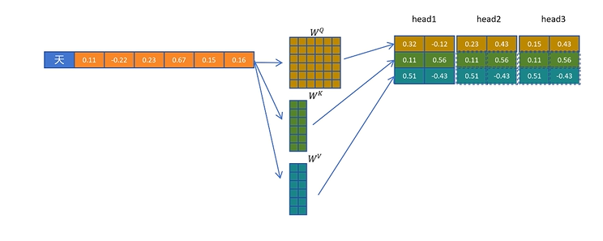
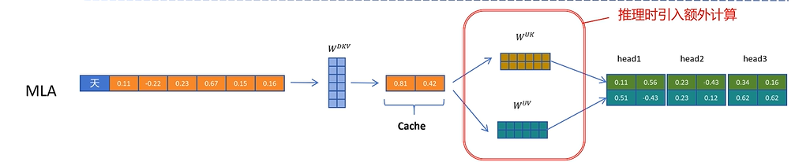
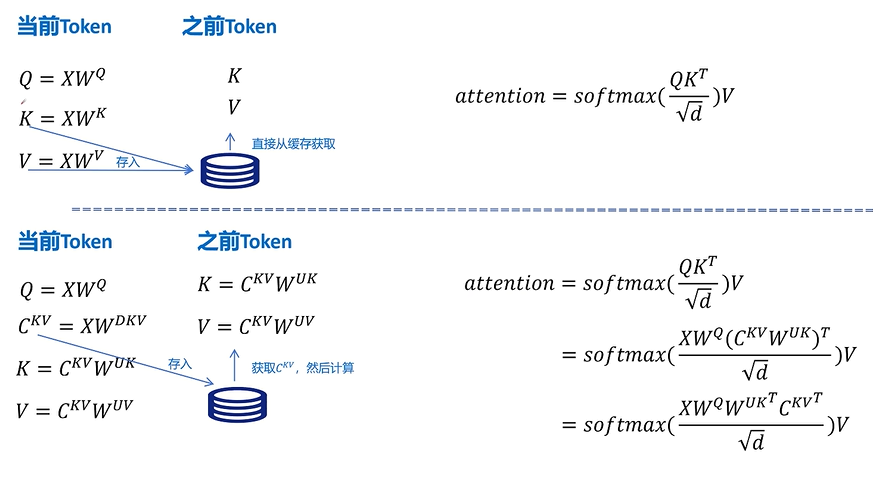
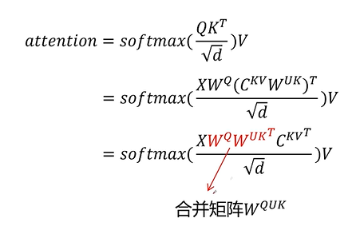
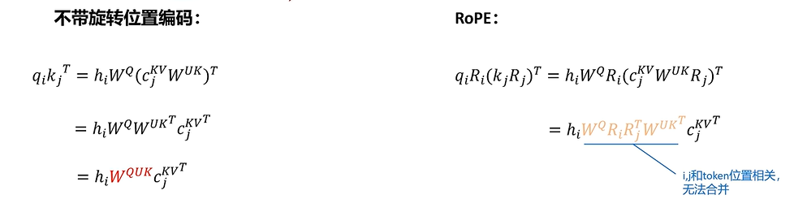
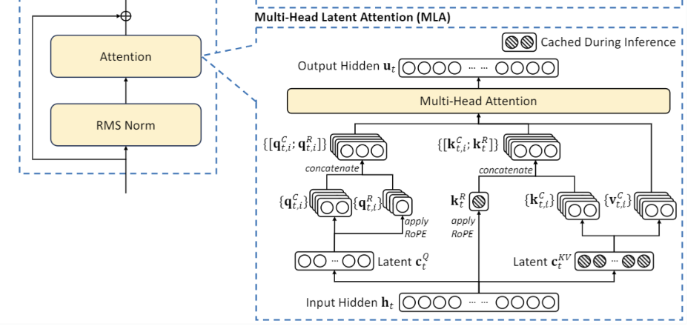

# MLA架构

## MHA架构

标准多头注意力

## MQA架构

复用了每个token的KV，会影响表现

## GQA架构

每两组token共享一组KV，本质是效果和性能的权衡

## MLA架构

对token先降维压缩，计算注意力时，通过升维矩阵进行解压

这里的融合本质理解，首先通过矩阵乘法满足结合律可知，可以先计算$W^{Q}W^{UK^T}$,由于两个W权重矩阵都是未知量，因此类比于$(y=ax_1 \dot x_2) => (y=ax_3)$,所以这里实际可以计算为一个未知矩阵。

但是以上的计算没有考虑RoPE

加上了旋转矩阵后以上就无法进行合并，因为每一个token的相对位置是变化的。

MLA架构为Q添加了一个$W^{QR}$矩阵，将token与该矩阵乘后的结果，在经过RoPE得到一个旋转向量，将该向量拼接到Q矩阵当中，从而添加了位置信息。

同样K也存在响应的R矩阵。

这样，将旋转位置编码与注意力计算解耦后，就可以实现矩阵融合的同时，利用到位置信息。