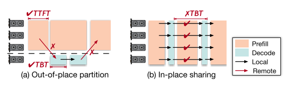

# Optimizing SLO-oriented LLM Serving with PD-Multiplexing

## limitation

### pd分配

in-place compute 和out-place compute方式，如图：

in-place计算通过将prefill与decode分离达到减低TBT的作用，out-place计算则是在实例内进行以上工作，能达到低内存开销，但是TBT无法保证

> 论文说将两者结合会带来较大的KV cache传输开销,out-place计算不也是跨实例传输嘛？

### prefill分块控制

为了满足TBT的需求，以前的做法将prefill分为了多个chunk，但是chunk大小不好控制，如果太大了TBT受到影响，如果太小了GPU利用率降低

且由于多个请求以及多个阶段间的kv cache共享，分块会造成对kv cache那一块内存的重复访问

## solution

