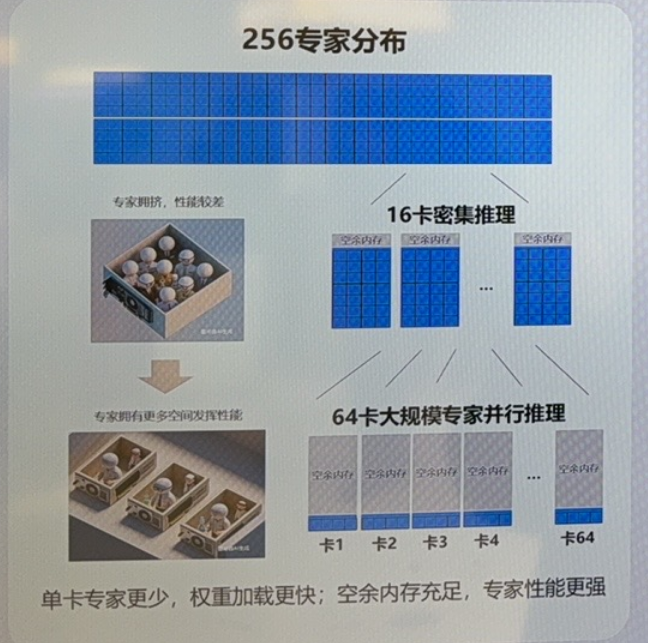
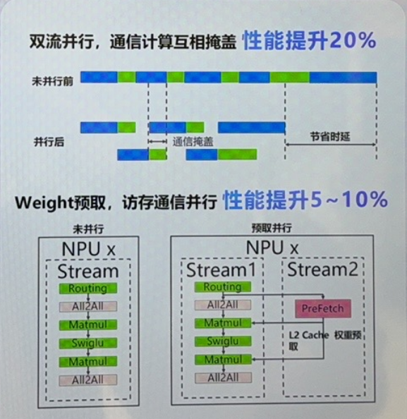
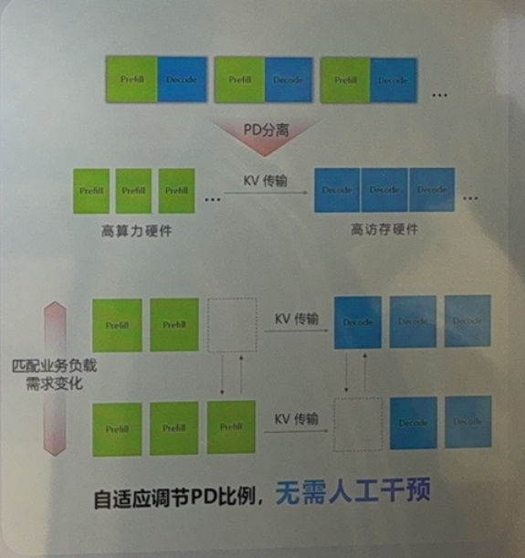
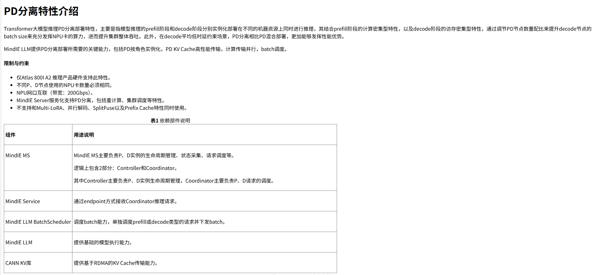
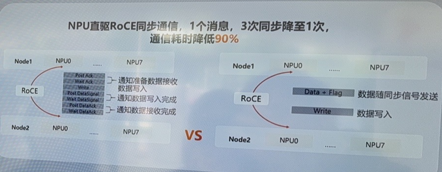
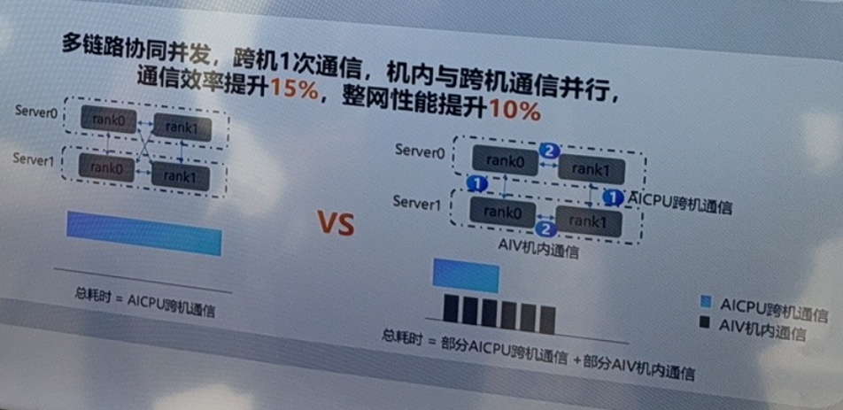

## 专家并行加速

这里应该是单纯的增加使用的卡数，对于moe来讲，可以将多个专家的参数放到一张卡上，由于token与参数的计算都是矩阵乘，可以将多个token的向量进行拼接，和多个专家同时拼成一张大矩阵乘来计算

但是不可避免地会增加单张卡地计算量，这里将16张卡上的专家拆到64张卡上，并行度提升是一方面，另一方面单张卡的计算量减少，性能自然提升，因此此处可能和所提到的内存空间更大没有太大的关系。

## 双流并行

这里双流并行可能是对于一个算子可以存在多个stream，只要stream的算子之间没有数据依赖，那就可以让两个stream互相争抢资源，以达到上面所说的计算与通信相互覆盖的效果。

## autoPD

关于这个的资料只找到[pd分离特性](https://www.hiascend.com/doc_center/source/zh/mindie/10RC3/mindiellm/llmdev/mindie_llm0291.html)

## 多链路并发与软硬件协同通信算法

这个上面是跨机通信的优化，原始的跨机通信需要按照roce网络通信的方式进行三次确认确保数据包送达，这里他们团队自己设计了通信原语，将数据与标志位一起传输，类似单机内的流水同步原语，使用waitflag和setflag的方式进行同步。（就是把多机也看做了多个部件，以流水并行的角度看待整个系统）

类似[fasstube](../../ann/faastube/faastube.md)这一篇，利用其他可达链路进行聚合通信，在这里也就是直接跨机通信，以及机内通信->跨机通信这两条链路可以同时使用。

## MLAPO

[MLAPO](../MLAPO/README.md)