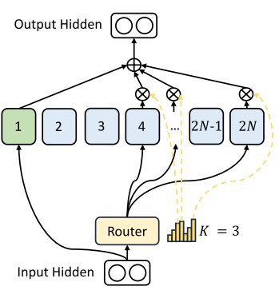
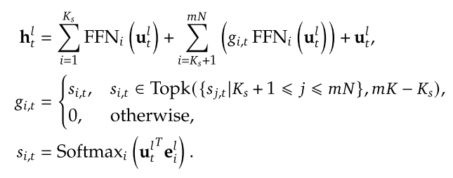
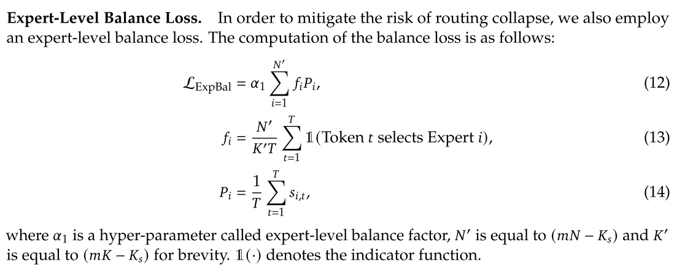
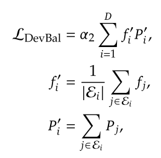

# deepseek Moe

[论文原文链接](https://arxiv.org/pdf/2401.06066)

## 传统moe存在的问题

+ 知识混合

就是虽然分了不同的expert，但是输入时，有些专家分配了多个token，蕴含不同的知识

+ 知识冗余

某些输入tokens包含的相同（通用）的知识，将会被每个专家学习到，那么专家的参数就是冗余的。

## 解决

### 细粒度化expert

+ 增加expert的数量

+ 降低expert ffn的参数量

相应的，将激活的expert的数量增大到m倍，以维持计算成本近似

moe部分计算公式如下：

$g_{i,t}$代表选择expert的权重

### 设置共享专家处理共享知识

新增了一定的shared expert，他们用来处理共享知识，结构如下图：

计算公式如下：

这些expert是固定激活的，不参与路由的选择，因此相应的，为了维持计算成本，将会将其余的expert的激活数减少，有多少个shared expert，就会减少相应数量的常规expert。

## 负载均衡问题

这个在[moe problems](../../algorithms/moe/readme.html#problems)提到了，也就是路由网络过分选择某几个专家，造成路由崩溃，同时如果专家分布在多个设备上，会因为负载不均衡产生计算瓶颈。

解决方法：

专家级平衡损失，用来解决某些expert分配的任务量过多，而有些闲置的问题导致的负载不均衡

没看懂，信息太少了

还引入了一个设备级平衡损失，用来解决设备负载不均衡，貌似是分组计算的：

### 有个视频讲了相关的损失

[视频链接](https://www.bilibili.com/video/BV15XFQebEBM/?spm_id_from=333.337.search-card.all.click&vd_source=e32e76663edb97323b10f324b6d846ec)

先看switch transformer中的做法，总的说，就是经过softmax每个expert会有个选择概率，然后将每个expert接收的token数占总token数的占比作为实际值，
将softmax输出值平均作为理论值，取差值为loss，用loss更新参数。如下：

然后发现，deepseek中提到的参数是在switch tranformer中的，所以deepseek直接略过了。。

其中的f就是实际值，P就是理论值。

视频提到了这个loss-func的问题，就是target是minimize这个loss，但是这个loss-func没有能力去最小化loss，计算公式的问题。也就是最终其实没有达到load balance的目的。

而deepseek中采用loss-free，在router的softmax中增加了一个bias用来修正，也就是如果某个专家过多被选择，这个bias会被减小从而减小该专家被选择的可能性（如果训练数据中该专家确实需要被多次选择，该做法是否会错过最佳路径？如果采用随机偏置是否有可能得到更好的效果）。类似于正则惩罚？和RL中的随机偏置也有点像。

