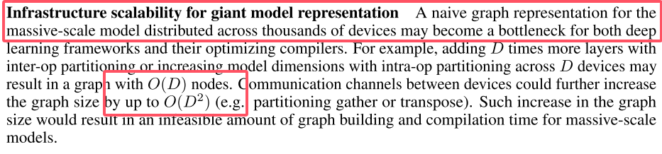
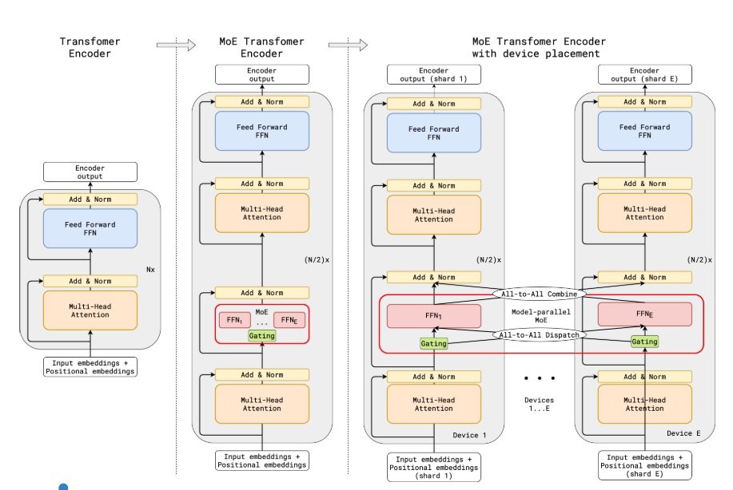
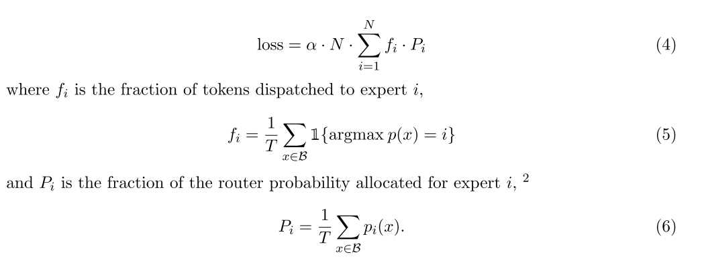
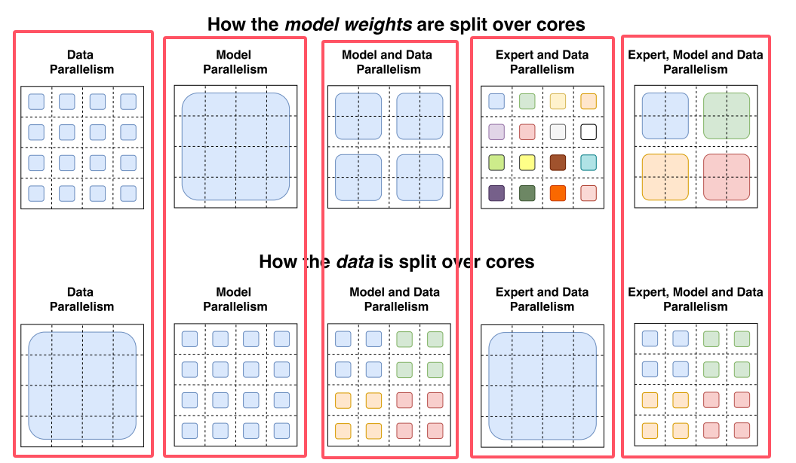
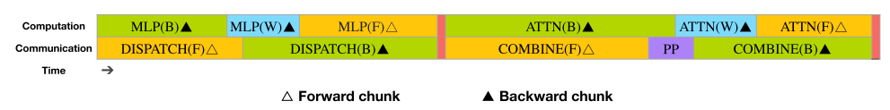

# moe parallelism

## GShard

[论文链接](https://arxiv.org/pdf/2006.16668)

论文中提到超过千台设备上的A naive graph representation将会成为计算的瓶颈。

对模型不同层进行分区，通过设备间通讯的方式同步参数将会涉及到底层通信机制的改变，对于开发者是一个严重的负担。

GShard是一个XLA的编译器扩展，简单来说就是按照其api规范添加注释，这个编译器会自动将模型进行分区，然后并行化。

### 多FFN跨设备

如图，feed forward被替换为多个expert，当采用多设备计算时，除开ffn部分，其余部分都是被复制到多台设备上。

3.2节再次提到，将注意力层复制到多个设备上，多个专家进行分割，分割到多台设备，因此，对于一台设备上的数据流，则类似原版的transformer。

每个router副本与每个expert进行all-to-all通信，容易理解。（糖丸了，all-to-all通信，这通信开销得多大啊）

### 自动分片

因为是利用了2048个TPU，那么如何利用tensor计算能力就很重要了，所以论文里面将tensor运算进行抽象，让用户将整个计算集群看作单个设备，只用加注释进行数据分片，至于哪些分片到哪个计算unit是系统负责的。我们主要探索分布式下的性能，所以不做过多探索。

## switch transformer

[论文链接](https://arxiv.org/pdf/2101.03961)

传统的moe将一个token路由到了多个专家，并将多个专家的输出乘以偏好进行输出，（也就是偏好决定了专家输出的重要性）。

本文rethinking这个操作，使k=1，（乐）

### 辅助损失

以上用于路由平衡，确保专家分配token的平衡，保证token dropped率低的情况下，减少expert容量。

### 不同并行方式对比

上面一排是权重参数在不同core上的分布，下面一排是数据在不同核上的分布。

直接看最后一个红框，按理说是最复杂的，对于上面的4×4方格，也就是16个core，不同颜色代表不同的权重参数，这里比较难理解，我看网上有的作者认为，对于第一个蓝色的块，里面是有四个expert的，他们作为一个整体在被处理，但是这样逻辑说不通。我更倾向于认为，一个块代表的一个expert，对于下面的数据分配，蓝色的块都是同一批数据，也就是比如[x1,x2,x3,x4]这么一组数据被复制到四个核上。

那么单个核的计算流程就变成了，一个批次的数据被input时，该核拥有一个专家的一部分参数，对应参数与数据中对应的部分计算后后，四个核的数据进行reduce，那么通信就被局限在了四个核中，从而减少了一定的通信量。

## 其他

显然，直接对transformer进行分层然后分配设备进行pipeline计算一定有相关课题，不做过多赘述。

## 梳理

那么从头看moe在多设备上的计算，从inference到back propagation。以每个设备分配一个专家为例。

+ 1，tokens被输入到模型，并进入device 0
+ 2，经过注意力模块计算，sync with other devices
+ 3，token经过router，得到输入每个expert的偏好值
+ 4，根据偏好值得到top-k个需要被激活的expert。
+ 5，将token投入这k个expert，注意到expert在其他设备上，因此这里面临第一重通信，tokens的传输。
+ 6，expert计算得到output后，所有的expert的output进行规约，那么这里面临第二重通信，output的传输。（还有个输入的残差结构的通信在上一重已经进行了）
+ 7，得到总的output后通过label得到loss，loss反向更新expert参数，expert反向的梯度将会更新router的参数，注意：router都是复制的副本，因此这里涉及第三重通信，gradient的传输/新parameters的传输
+ 8，梯度传到注意力模块，再次进行参数更新，产生gradient的传输/新parameters的传输

从以上过程看，一旦设备数过多，那么就会产生大量的设备间通信。

需要注意的是，以上只是一个基础的过程，实际执行中不同设备同一时刻的输入tokens可能是不同batch的数据，此时多设备间进行梯度合并更新参数。不同的策略将会极大的影响moe的效率。

那么问题转移到了，怎么平衡计算与通信，如果看计算的极端，就是让每个设备都维护一份gradient，从而单独计算从而更新参数；那么通信的极端就是只让一个主机进行计算，其余从机继续向下一个状态转移，主机计算完成后，通知从机更新后的参数。

## dualPipe

直接讲主要方法，

关于双路pipeline，如下：

上面是常规的流水（8卡），将整个网络中的layer平等的分为8份，每一份放在一张卡上，例如GPU0持有layer0-9，GPU1持有layer10-19，以此类推。

那么对于上面一部分，训练流程如下：

+ 1，batch0输入GPU0，layer进行inference，将output传输到GPU1，以此类推，直到layer7得到输出。
+ 2，计算loss
+ 3，从layer7开始反向传播，将gradients传输到GPU6，以此类推，传输的同时进行参数更新。
+ 4，循环以上步骤

通过调整forward与backward的顺序，能够减少流水线中的气泡，例如1F1B，ZB-PP等。

因此引出下面一部分，我们需要结合论文中提到的Overlapping strategy来看：

上面的图是dualpipe中的pp方式，可以注意到的是，GPU0，GPU7同时持有layer0，那么我们在一开始可以同时输入两个batch分别到GPU0与GPU1
需要注意的是，这种操作单独来看并没有什么太大的作用，因为每个GPU同一时刻的计算能力仅能够负载一个layer的forward/backward。好就好在dualpipe中设计了下面流水块。

我们需要知道在单个GPU内，通信与计算是独立的，意味着这两者也可以形成流水，所以dualpipe设计了下面的流水方式。

上面是一个紧密的流水块，怎么来的？看下面的流水线，可以注意到，两头batch输入，同时采用FB交替的方式进行流水，在流水线的中间部分就会“产生”这样的块。

（节奏大师）

## 整体分布

那么综合以上的并行结构，粗略的总结一个整体的分布式架构（或者pp在节点间进行？）：

expert位于多个节点上，由于每一个batch的数据不同，router产生的结果也不同，导致每一次激活的expert也不同，因此，不可避免的，采用all-2-all通信是最佳选择。

> 一个问题是，为什么不在节点间流水？因为每个expert并不是每一次都会被激活，直觉上router产生的节点间的通信带宽需求远远小于pp中的数据传递。

> 同时也可以注意到，之前的主要瓶颈在于节点间的通信，因此负载均衡loss func的提出才能有效的提升整体的效率。

那么所谓的拓扑架构也就不再存在，因为不存在一个数据跨越多个节点传输的问题。