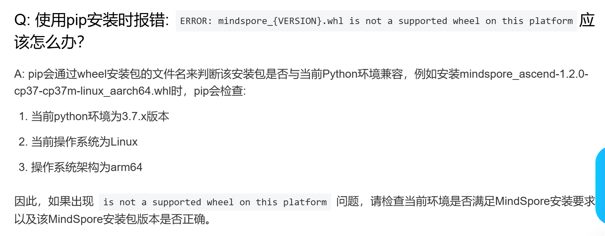
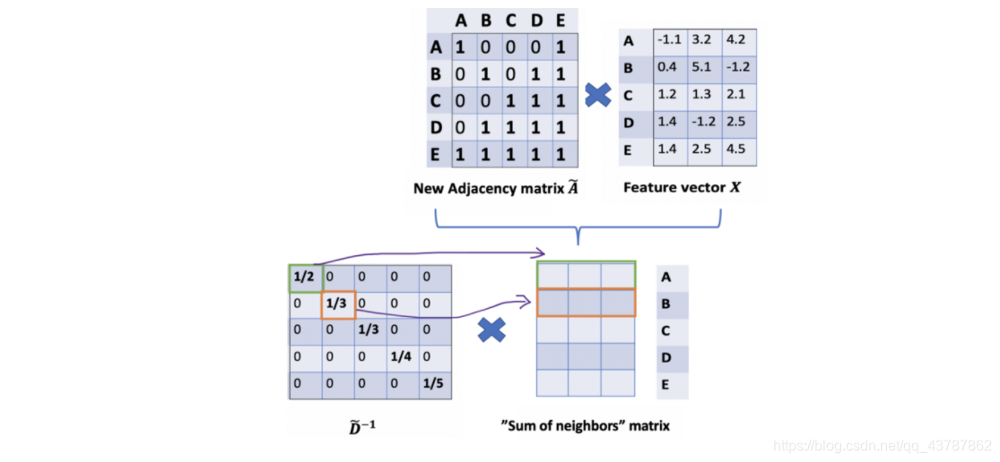
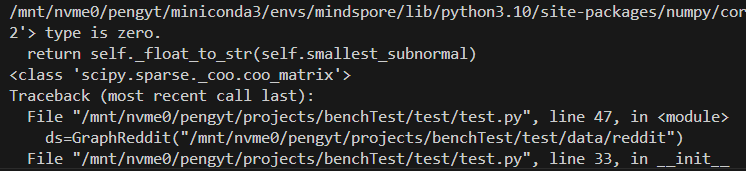
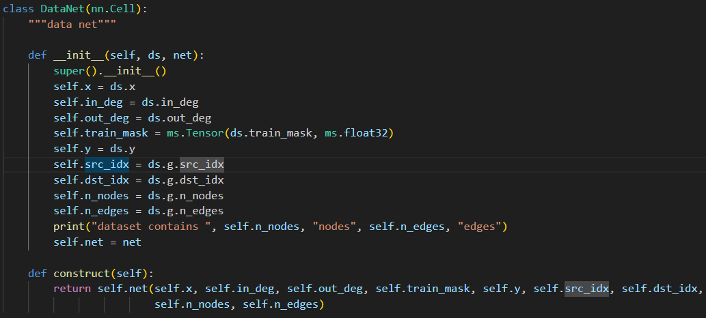
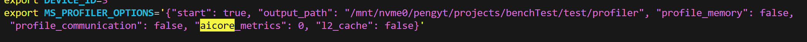
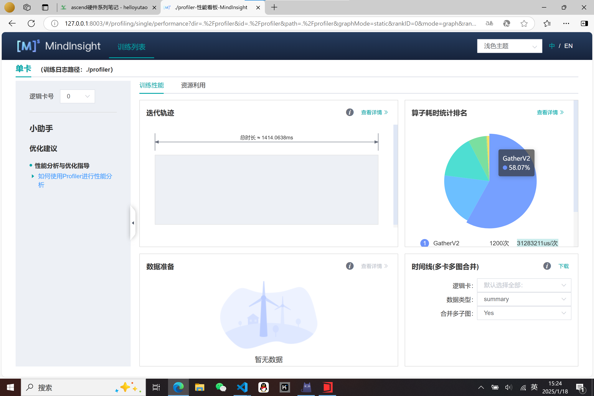
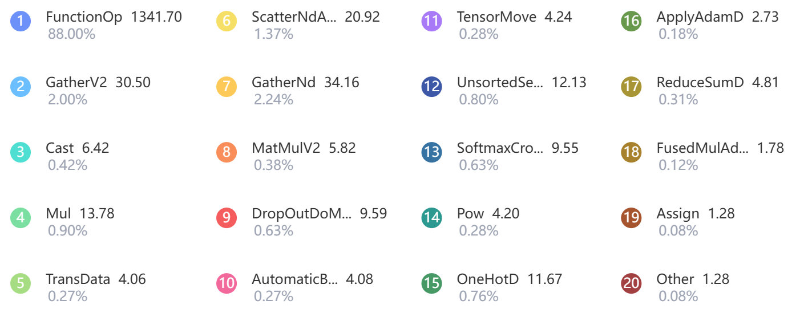
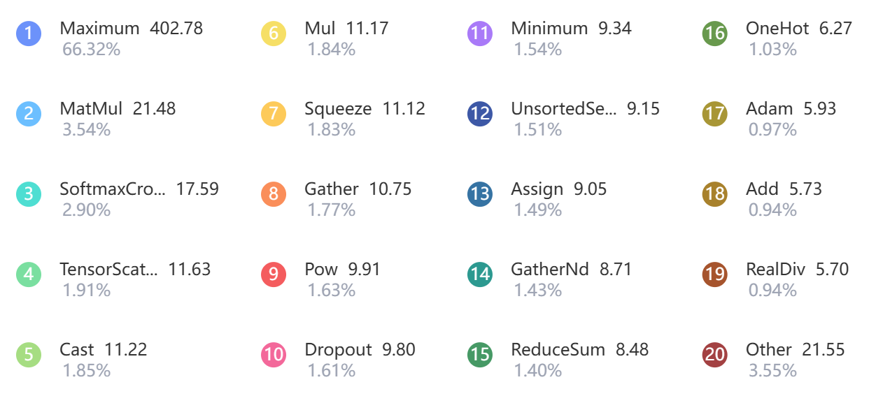

# ascend bench test

## work target

围绕mindspore graphlearning 使用官方提供的profile工具，做一些测试
1.运行GCN算法，使用reddit数据集（也可以考虑多个数据集，或者变换隐藏层维度），对比昇腾与GPU的性能差异（epoch运行时间）。 mindspore 即能跑GPU也能跑昇腾
2.profile一下mindspore graphlearning 在运行GCN算法时，不同算子在不同计算单元（CUBE/VECTOR/Scalar/AICPU）上的执行时间占比，profile工具好像还提供可视化算子流水的功能，能可视化一段时间内，是哪个算子在运行

## 安装Graph leaning
>! 一定要先进行这一步，如果你先安装mindspore，安装gl会进行环境检查，然后告诉你平台不对。（逆天bug）

记得先使用镜像安装requirements.txt中的依赖，不然后面自动下载依赖很慢

[官网教程](https://www.mindspore.cn/graphlearning/docs/zh-CN/r0.2/mindspore_graphlearning_install.html)

cuda-gpu版本安装，需要注意环境问题,python只能是3.7



>! 血泪教训，记得添加CUDA_HOME环境变量，mindspore是根据cuda_home的变量来寻找cudatoolkit的位置的，官网没说，乐

## 安装mindspore

[官网教程](https://www.mindspore.cn/install/)

## gcn

不讨论其公式原理，和拉普拉斯矩阵相关，傅里叶那一套的数学转换方法，挺杂乱的，这里直接给出算法原理



如上图，一个layer中的聚合方式，邻接矩阵矩阵乘节点特征矩阵达到聚合的目的。

对计算结果归一化，使用度矩阵（degree）乘上上面的计算结果。

但是如果仔细观察就会发现，该归一化的作用范围仅有行，例如图中的1/3，被1/3乘的只有横着的一行，也就是单向边，想要对列也起作用，那么在另一边也乘一个度矩阵逆即可。

但是乘了两次，所以使用$D^{-1/2}$来减轻归一化的程度（不严谨说法）

上面的过程用公式表述为
$$D^{-1/2}AD^{-1/2}X$$

在神经网络中还会乘上一个权重矩阵W,再激活一下，加个偏置，标准做法了

$$ReLU(D^{-1/2}AD^{-1/2}XW+B)$$

以上就是一层的计算过程了，实际上一直到计算归一化的过程都是可以进行简化的。也就是进行融合。

## 数据集

### reddit

[下载地址](https://data.dgl.ai/dataset/reddit.zip)

读取数据集，该数据集不像corav2几乎给了所有的列名，所以需要转换一下。

很坑的一点是，官网说Reddit类返回的adj_coo是ndarray类型，结果一打印，发现是scipy的coo_matrix格式，他们官网的文档完全是在误导人。



数据读取转换代码如下：
```python
class GraphReddit:
    """Full training numpy dataset """
    def __init__(self, data_path: str) -> None:
        graph= Reddit(data_path)
        self.x = ms.Tensor(graph.node_feat,dtype=ms.float16)
        self.y = ms.Tensor(graph.node_label, ms.int32)
        self.train_mask = graph.train_mask
        self.test_mask = graph.test_mask
        self.n_nodes = graph.node_count
        self.n_edges = graph.edge_count
        self.g = GraphField(ms.Tensor(graph.adj_coo.row, dtype=ms.int32),
                            ms.Tensor(graph.adj_coo.col, dtype=ms.int32),
                            int(self.n_nodes),
                            int(self.n_edges))
        self.n_classes = int(graph.num_classes)
        in_deg = np.zeros(shape=self.n_nodes, dtype=np.int64)
        out_deg = np.zeros(shape=self.n_nodes, dtype=np.int64)
        for r in graph.adj_coo.row:
            out_deg[r] += 1
        for c in graph.adj_coo.col:
            in_deg[c] += 1
        self.in_deg = ms.Tensor(in_deg, ms.int32)
        self.out_deg = ms.Tensor(out_deg, ms.int32)
        print("data prepared")
```

ok,那我开骂了，那两个for语句给我整笑了，如果出入度形状对不上，后面就会报错（alloc error gather）的问题，报错牛头不对马嘴。
最离谱的是，python的for慢地吃屎，numpy的优势属于是荡然无存了，样例里面写出两个for我能感觉到写这段代码的人的无语了。

## 模型

还得吐槽
为什么一定需要套一个Datanet的inference层？？不是很明白这么做的意义是什么



## 性能监测

1，使用profiler的api

在训练代码前添加

`profiler = Profiler(profiler_level=ProfilerLevel.Level0,output_path="./profiler",profile_memory=True,hbm_ddr=True)`

训练结束后添加

`profiler.analyse()`

but我的没有生效，生成的数据无法通过mindinsight查看

2，使用环境变量

在bashrc中添加



再次运行训练代码,

通过`mindinsight start --port 8003 --summary-base-dir root_dir`

即可查看数据可视化如下：


## 性能分析

由于mindspore-gpu下跑gcn整图训练reddit数据集会爆（gpu4090，24GB显存），所以我们使用cora_v2进行对比

Ascend



CPU



基本都是计算各算子的时间占比，一方面不熟悉这些算子功能，另一方面做加速对功能不敏感，但是对实现敏感，所以这里暂时转向[算子开发验证](../mindspore_develop/readme.html),还有一部分原因是，其文档过于杂乱，有部分算子甚至是在mindspore版本1.3中才有，有一些又是使用的tf的接口。