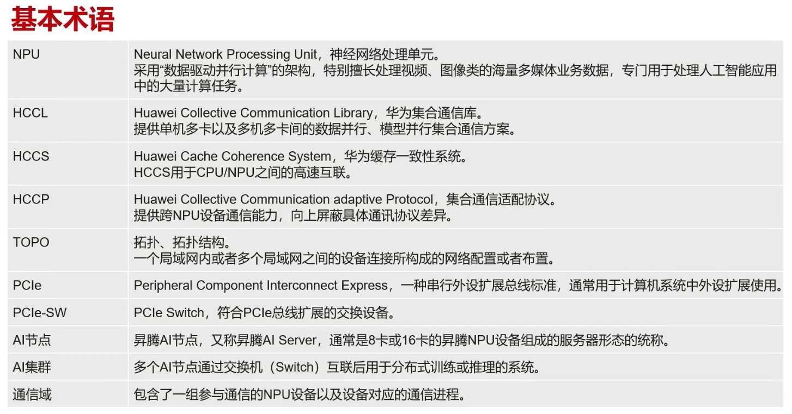
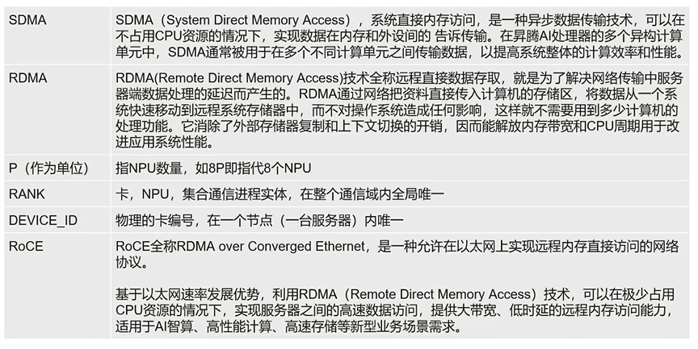
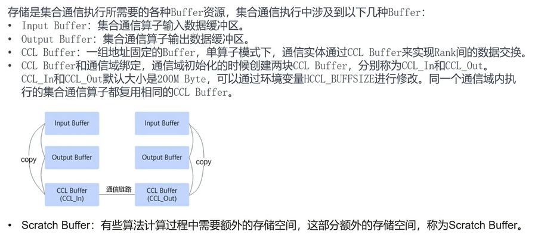
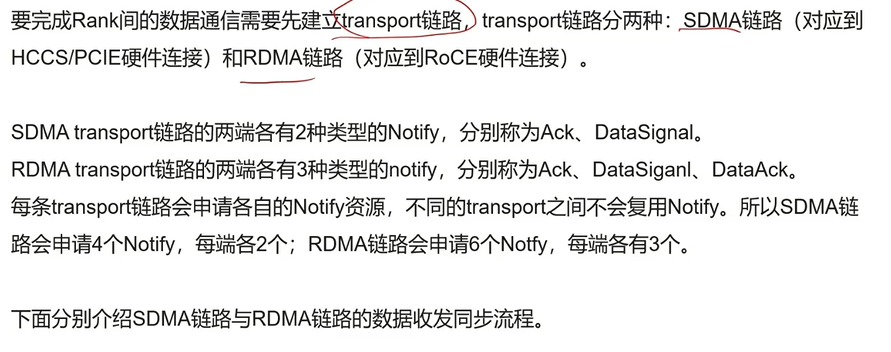
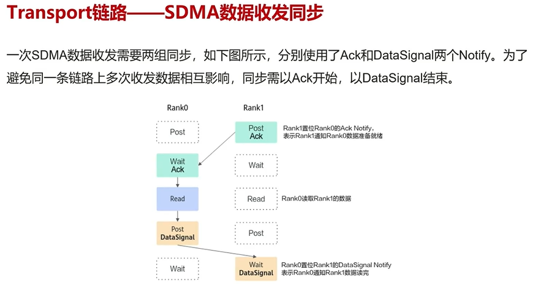
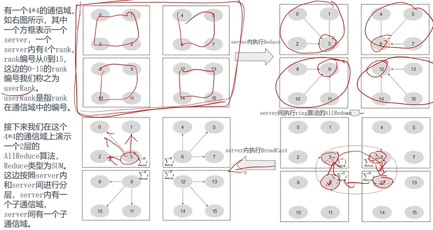
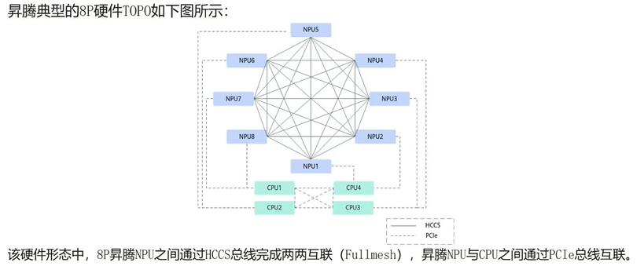
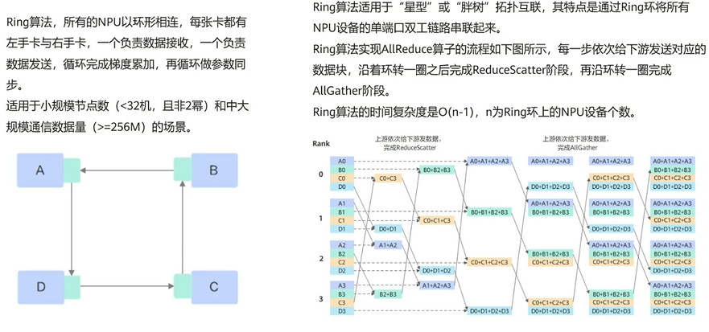
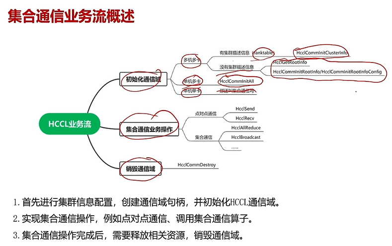
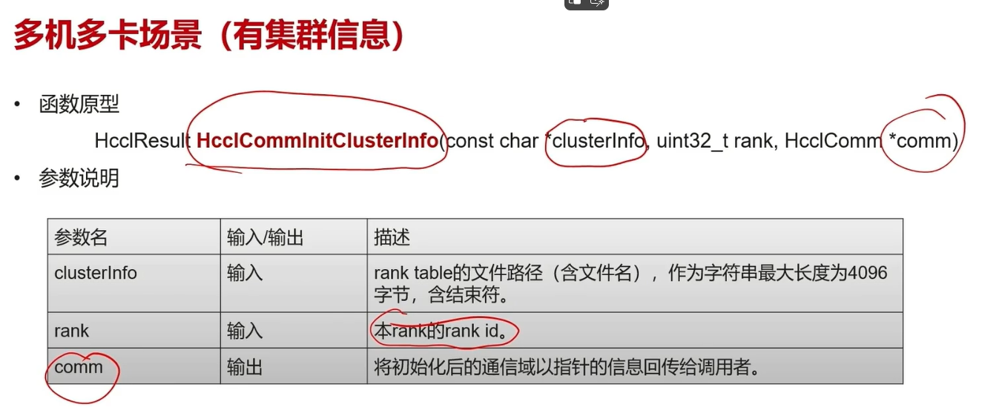

# HCCL

## 概念

### 基本术语

SDMA是节点内的不同RANK通信，RDMA是节点间的不同RANK通信。

### buffer

从一个实体往另一个实体传输数据时，数据首先存到output buffer，再复制到CCL buffer，CCL buffer传输到另一个实体，另一个实体的CCL buffer再copy到input buffer，从而实现完整的传输过程。

### 流

任务队列

通过Post/Wait进行同步。Post是将对应流的notify硬件寄存器的值置为1，Wait则是置为0，notify为1时，流会被阻塞在Wait语句。

### 通信链路

### 通信域

### 硬件架构

## 常见集合通信算法

### Mesh

上面主要利用全双工的特性，一个NPU可以同时发送它自身的数据到所有的其他NPU，同时能够接收其他NPU发送到他的数据，由于全双工特性，两者可以同时进行，因此发送的时间仅为要处理数据的串行时间。

### ring

适用与环形结构

### RHD

递归二分与倍增

先做聚集，再两两之间交换。

### pairwise（all2all）

原本是一个npu向所有的npu发送，如果是mesh那样全双工，将会存在资源争抢，由于节点只有一个RDMA网口，所以性能问题常出现在节点间数据通信。

即，当一个节点向其他节点采用mesh执行all2all，所有节点将会同时进行收发所有其他节点的数据，造成资源争抢，导致性能下降。

pairwise算法使用迭代间隔发送，
第一个迭代，1向2发送，2向3发送，3向4
第二个迭代，1向3，2向4，3向5.

### star（有根节点，例如reduce存在汇聚）

### hccl支持的原语

## 通信业务流

每一个rank都需要初始化通信域，每张卡都有自己的ip，

如果没有ranktable json，可以通过初始化root节点，并使用mpi广播通知其他rank。

### 集合通信

每一个rank都需要执行该函数

## 算子实现

