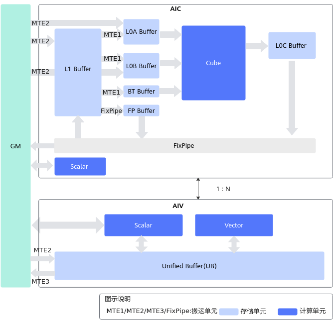
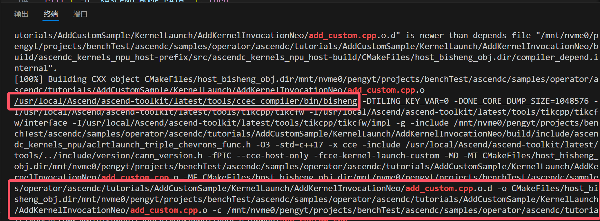
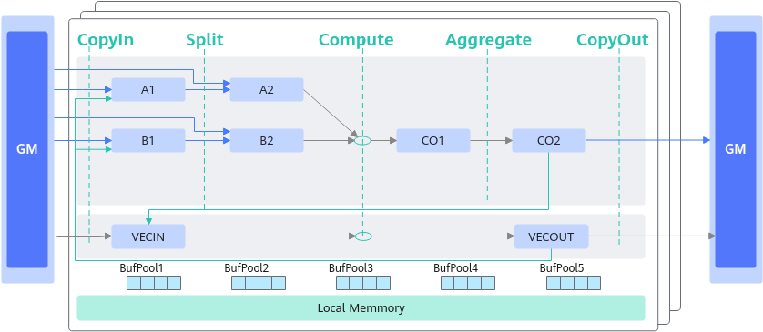
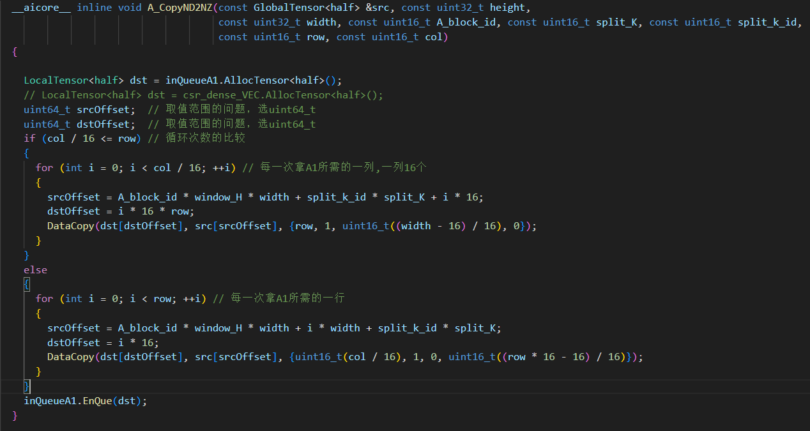
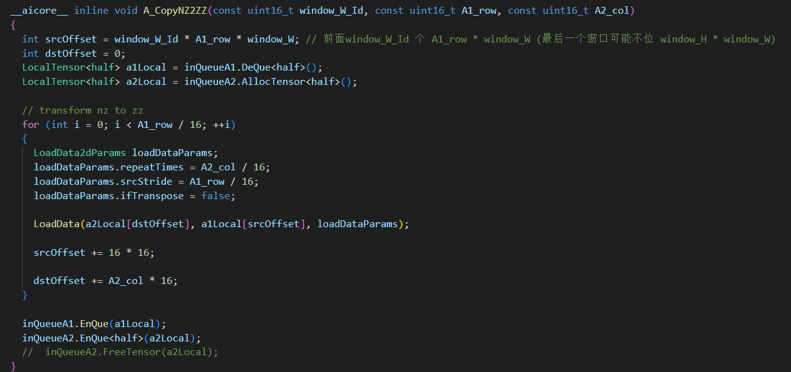
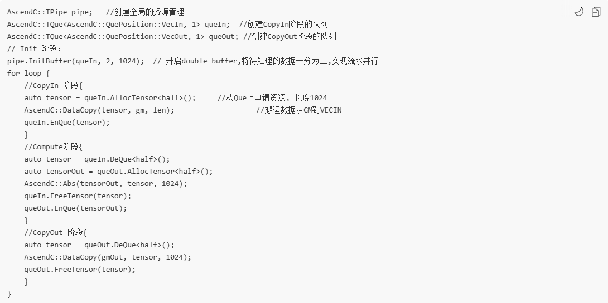
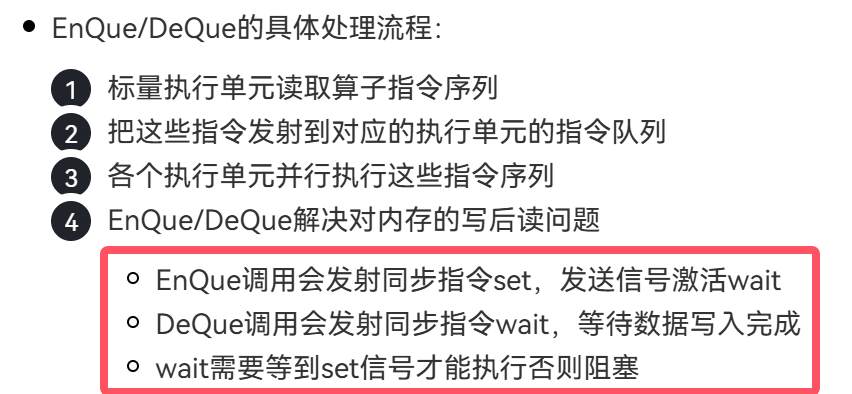
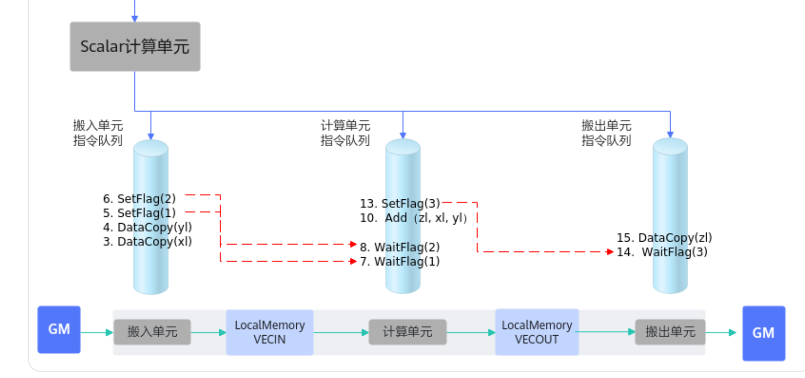
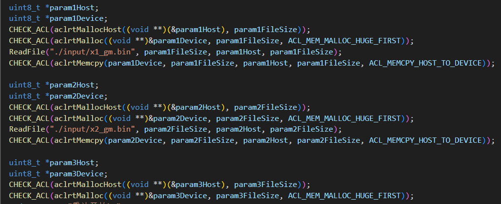
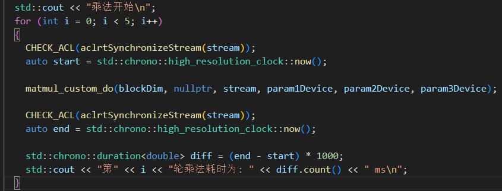

# 算子开发教程

[教程](https://www.hiascend.com/edu/courses?activeTab=%E7%AE%97%E5%AD%90%E5%BC%80%E5%8F%91)

## cann架构


cann类似于cuda，因此底层都是基于bisheng/nvcc编译器的。

算子是通过bisheng编译成动态库的。

## 硬件架构


> AI Core负责执行标量、向量和张量相关的计算密集型算子，包括三种基础计算单元：Cube（矩阵）计算单元、Vector（向量）计算单元和Scalar（标量）计算单元，同时还包含存储单元（包括硬件存储和用于数据搬运的搬运单元）和控制单元。

+ 耦合架构


+ 分离架构



> 在AI Core中，输入缓冲区之后设置了一个存储转换单元（Memory Transfer Unit，MTE）。这是达芬奇架构的特色之一，主要的目的是为了以极高的效率实现数据格式的转换。比如前面提到GPU要通过矩阵计算来实现卷积，首先要通过Im2Col的方法把输入的网络和特征数据重新以一定的格式排列起来。这一步在GPU当中是通过软件来实现的，效率比较低下。达芬奇架构采用了一个专用的存储转换单元来完成这一过程，将这一步完全固化在硬件电路中，可以在很短的时间之内完成整个转置过程。

这样看，专用硬件上的卷积加速算是走到头了，欸

## bisheng Test

测试代码如下：
```c
// 文件名QuickStartDemo.cce
#include "acl/acl.h"
#include <stdio.h>
#include <stdlib.h>

#ifdef ASCENDC_CPU_DEBUG
#define __aicore__
#else
#define __aicore__ [aicore]
#endif

#define BLOCKS 4
#define CACHELINE_SZ 64

// Define a kernel
__global__ __aicore__ void foo(__gm__ uint8_t *Out, int Stride) {
    Out[block_idx * Stride] = block_idx;
}

int main(int argc, char *argv[]) {
    aclInit(nullptr);
    aclrtSetDevice(0);
    aclrtStream stream;
    aclrtCreateStream(&stream);

    uint8_t ExpectedValue[] = {0, 1, 2, 3};
    uint8_t *OutputValue = nullptr;
    aclrtMalloc((void **)&OutputValue, BLOCKS, ACL_MEM_MALLOC_HUGE_FIRST);

    uint8_t InitValue[BLOCKS] = {0};
    aclrtMemcpyAsync((void *)OutputValue, sizeof(InitValue), InitValue,
                     sizeof(InitValue), ACL_MEMCPY_HOST_TO_DEVICE, stream);
    aclrtSynchronizeStream(stream);

    // Invoke a kernel
    foo<<<BLOCKS, nullptr, stream>>>(OutputValue, CACHELINE_SZ);

    uint8_t *OutHost = nullptr;
    aclrtMallocHost((void **)&OutHost, BLOCKS * CACHELINE_SZ);
    aclrtMemcpyAsync(OutHost, BLOCKS * CACHELINE_SZ, OutputValue,
                     BLOCKS * CACHELINE_SZ, ACL_MEMCPY_DEVICE_TO_HOST, stream);
    aclrtSynchronizeStream(stream);

    for (int I = 0; I < sizeof(ExpectedValue) / sizeof(uint8_t); I++) {
        printf("i%d\t Expect: 0x%04x\t\t\t\tResult: 0x%04x\n", I, ExpectedValue[I],
                OutHost[I * CACHELINE_SZ]);
    }

    aclrtFreeHost(OutHost);
    aclrtFree(OutputValue);

    aclrtDestroyStream(stream);
    aclrtResetDevice(0);
    aclFinalize();
    return 0;
}
```

如果你对上面直接使用

`bisheng -O2 --cce-soc-version=AscendXXXYY --cce-soc-core-type=VecCore  -I$RT_INC -L$RT_LIB -lascendcl -lruntime QuickStartDemo.cce  -o QuickStartDemo`

会告诉你架构不支持Ascend910B

但是，如果使用官方提供的脚本是可以编译通过的，那我们知道官方示例代码中存在异构代码，因此不可能使用gnu标准的gcc编译器，只有可能使用bisheng。

那我们通过编译官方示例，并查看对应的异构代码的编译命令

进入build目录执行

`make VERBOSE=1 | grep add_custom.cpp`



找到编译器实际路径，我们再使用该路径编译器编译代码

还是架构不支持

测试以下编译指令

```makefile
cc1:=/usr/local/Ascend/ascend-toolkit/latest/compiler/ccec_compiler/bin/bisheng
cc2:=/usr/local/Ascend/ascend-toolkit/latest/tools/ccec_compiler/bin/bisheng

all:
	$(cc2) \
	-I/usr/local/Ascend/ascend-toolkit/latest/runtime/include \
	-L/usr/local/Ascend/ascend-toolkit/latest/runtime/lib64 -g \
	-O2 \
	--cce-soc-version=Ascend310P1 --cce-soc-core-type=AICore \
	-o QuickStartDemo.o \
	QuickStartDemo.cce 
```

使用310P1架构与AICore类型交叉编译，出现链接错误


推测当前的编译器仅支持编译算子，并不支持编译为可执行文件（欸，懒得骂了）

## kernel算子开发(矩阵乘)

### 编译

clone算子example，然后执行sudo bash run.sh -r npu -v Ascend910B

### 编程范式

对于矩阵乘，其运算api为[Mmad](https://www.hiascend.com/document/detail/zh/CANNCommunityEdition/800alpha001/devguide/opdevg/ascendcopdevg/atlas_ascendc_10_0016.html?sub_id=%2Fzh%2FCANNCommunityEdition%2F800alpha001%2Fapiref%2Fascendcopapi%2Fatlasascendc_api_07_0239.html#ZH-CN_TOPIC_0000002082776405__section8213173433312)，但是要执行该操作，需要内存中的数据满足zz的格式。



上面是cube的运算流程，使用copyin，compute，copyout的运算流程，核函数中也遵循该流程。

更详细的流程是，先将输入矩阵传入A1，B1，如下：


接着将矩阵分块后存入A2，B2，如下:


然后进行矩阵运算，[Mmad](https://www.hiascend.com/document/detail/zh/CANNCommunityEdition/800alpha001/devguide/opdevg/ascendcopdevg/atlas_ascendc_10_0016.html?sub_id=%2Fzh%2FCANNCommunityEdition%2F800alpha001%2Fapiref%2Fascendcopapi%2Fatlasascendc_api_07_0239.html#ZH-CN_TOPIC_0000002082776405__section8213173433312)，再将结果输出到CO1，将分块后的结果融合成最终结果，然后存入CO1。

A2与B2内数据格式如下：


需要注意的是以上流程中的数据搬运都是通过队列排队实现，这样才能够实现流水线的效果。



按照上图中的代码，即可实现流水，从逻辑上看，datacopy的工作必然由一个独立单元mte负责，mte与compute单元并行执行才能达到流水的目的。

假证也可推理，即，如果上述代码是串行执行，那么没必要使用queue，直接使用转置后的数据即可。

下面两图协同证明,datacopy任务指令序列在搬运单元中执行，搬运完后执行了setflag通知计算单元：



### 调用

+ 创建上下文


+ 分配设备空间



+ 调用内核函数


