# 910B1相关问题

## 环境

910A环境变量：

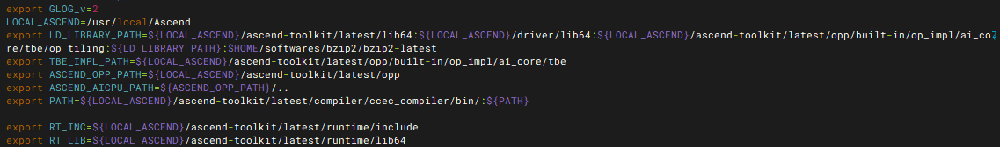

910B1环境变量：

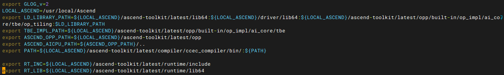

## 分支代码

代码位置

+ 910A /mnt/nvme0/pengyt/projects/matrix/optimize/ascendc

+ 910B1 /mnt/nvme0/pengyt/project/ascendc

执行命令：

`./batch_run.sh batch_config`

### master分支

实现简单的分块矩阵乘

+ 按行列组为aicore分配计算任务

+ 组内再切分以外积的方式进行计算

+ 计算结果在CO1累加，最后经CO2搬出到GM

如下图：

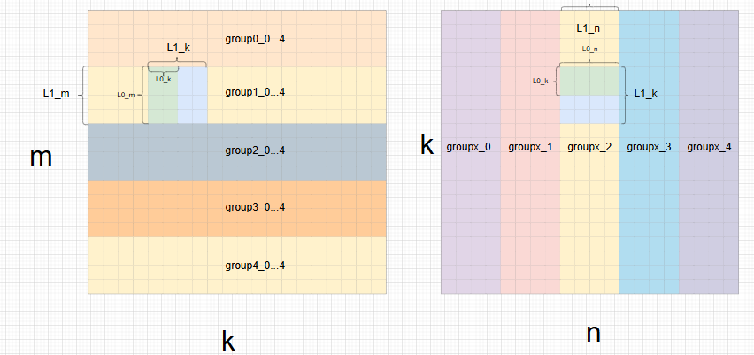

910A执行结果：

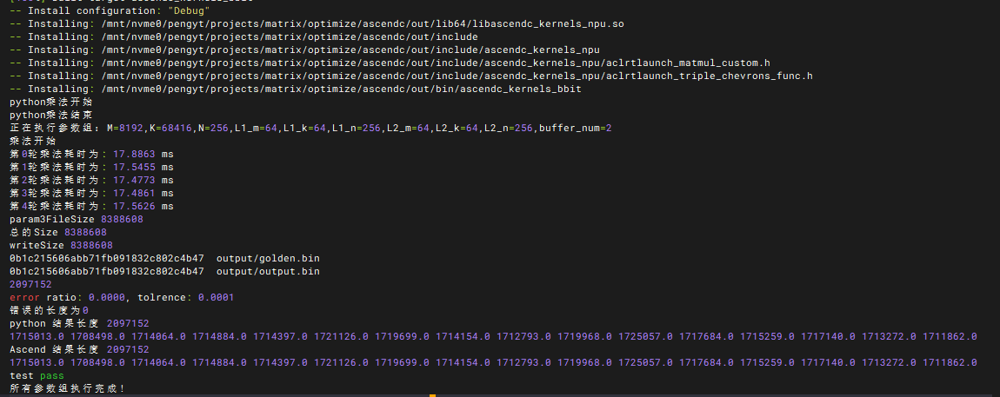

910B1执行结果：

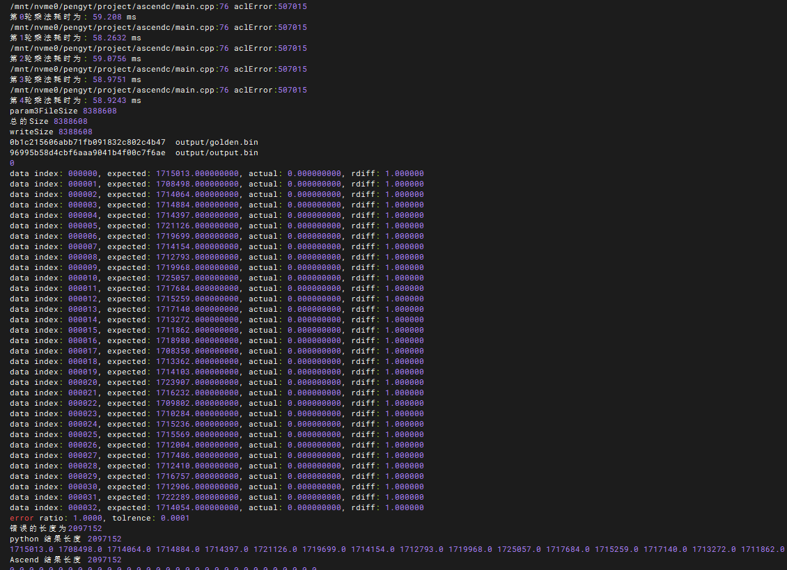

分析：

注释掉代码主逻辑，进行一次分配与释放，

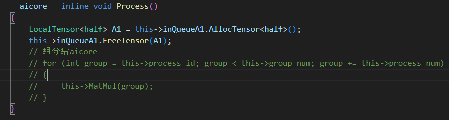

出现如下错误：

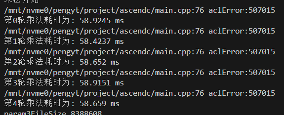

注释掉所有逻辑：

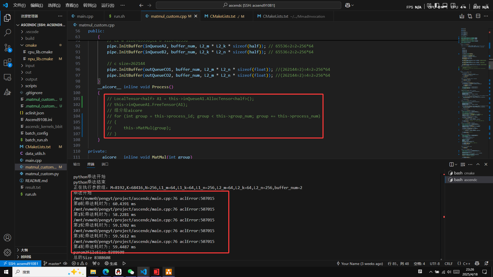

发现调用kernel就在报错：

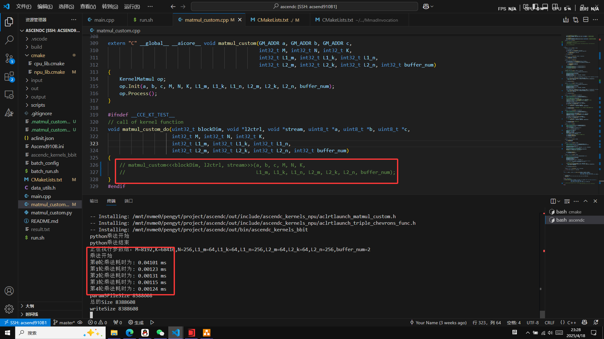

### smaller_tile分支

提高第二次切分的细粒度，能够充分利用L0缓存，而不必受限于第一次切分的矩阵形状

+ 按行列组为aicore分配计算任务

+ 组内再切分以外积/内积的方式进行计算

+ 计算结果在CO1累加，最后经CO2搬出到GM

如下图：

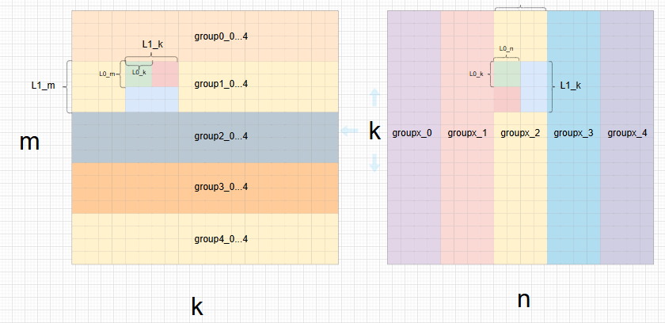

910A执行结果：

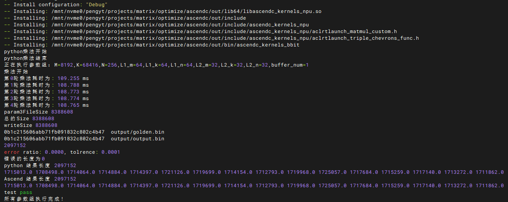

910B1执行结果：

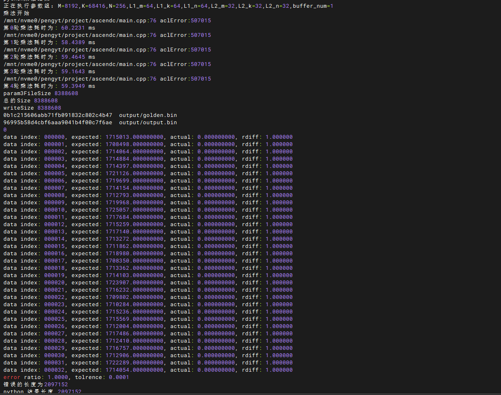

### cvAgg_dataTransInhost分支

+ 按行列组为aicore分配计算任务

+ cube内按照master方式进行计算

+ vec的任务分配由eq_core_num参数决定，计算公式为

$$task=\frac{group\_sum}{block\_num + eq\_core\_num} \times eq\_core\_num$$

如下图：

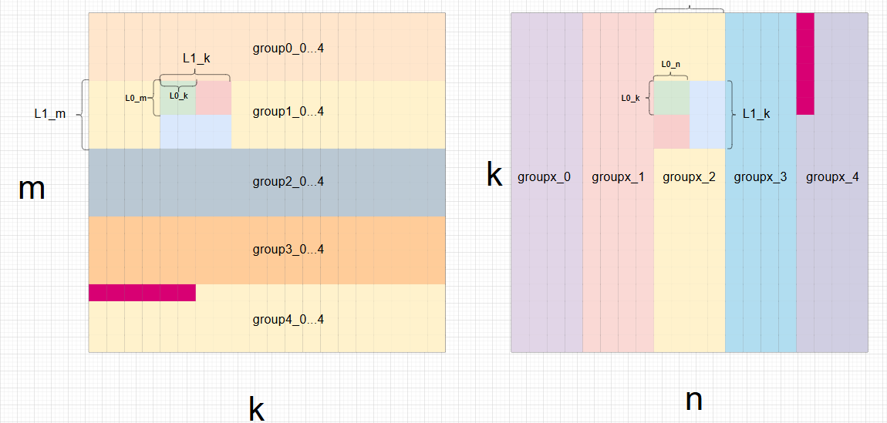

910A执行结果：

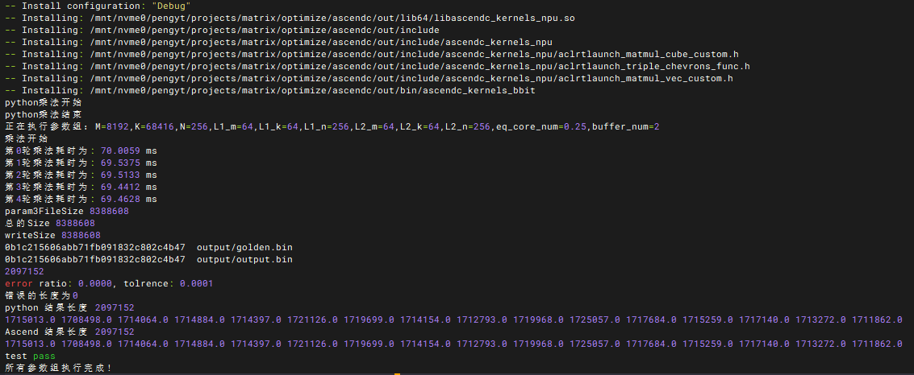

910B1执行结果：

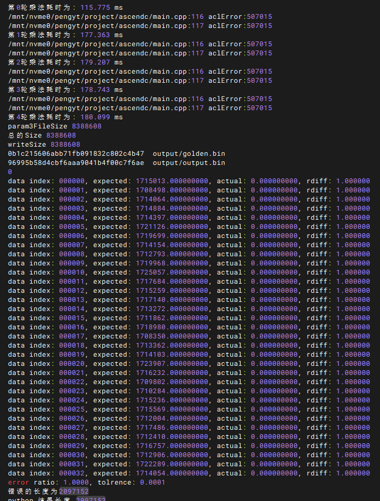
