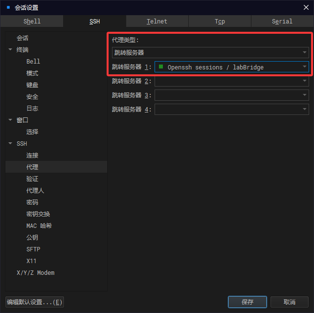

# 快速开始

## docker（推荐）

非root用户以下所有指令都应在指令前添加sudo赋权。

+ 拉取镜像

    `docker pull docker.1ms.run/cnameless/blkrv`

+ 运行镜像

    `docker run -itd -p 59066:22 -p 59067:8000 --name blkrv docker.1ms.run/cnameless/blkrv:1.0 /bin/bash`

    此时宿主机的59066端口映射到容器的22端口，用于ssh连接，59067映射到8000端口用于访问可视化服务

+ 安装并启动ssh服务

    `docker exec blkrv apt install -y openssh-server && docker exec blkrv service ssh start`

+ 连接镜像

    - [windterm（推荐）](https://github.com/kingToolbox/WindTerm/releases)
    
    如果在windows上使用虚拟机，那么此时需要使虚拟机作为代理服务器连接docker，代理服务器配置如下：

    

    主机ip为虚拟机地址，跳转服务器的ip为docker的ip地址。

    - 虚拟机直接进入docker

    `docker exec -it blkrv /bin/bash`

    - vscode

    配置ssh连接配置如下：
    ```config
    Host j2docker
        HostName [docker镜像ip]
        User root
        Port [docker镜像ssh端口]
        ProxyJump user@[虚拟机ip]:[虚拟机ssh端口]
    ```
    docker镜像ip获取：

    `docker exec blkrv apt install -y net-tools && docker exec blkrv ifconfig`

## 手动安装（推荐使用docker的方式，节省时间）

[verilator编译教程](../tools/verilator/verilator.html)

[riscv编译链编译教程](../tools/riscv-elf-unknown-gcc/gcc.html)

[fltk安装教程（可选）](../tools/fltk/fltk.html)

## 编译＋执行

+ 递归克隆项目
    
    `git clone --recursive https://gitee.com/helloyutao/blkrv.git`

+ 编译运行项目

    - cli
    
        `make`
    
    - 带图形化界面（依赖flkt库）

        `make ENABLE_GPU=1`

        需要注意该编译方式标准输入将会被重定向到图形化窗口，输入将不被命令行接收。