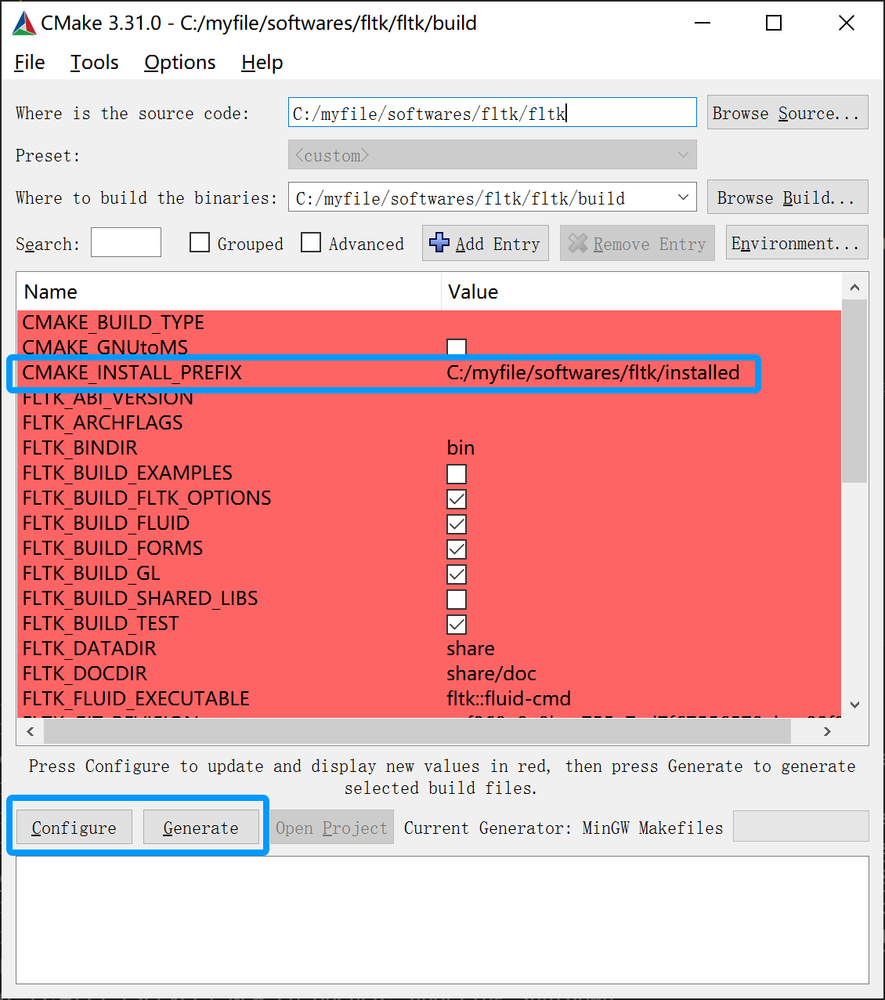
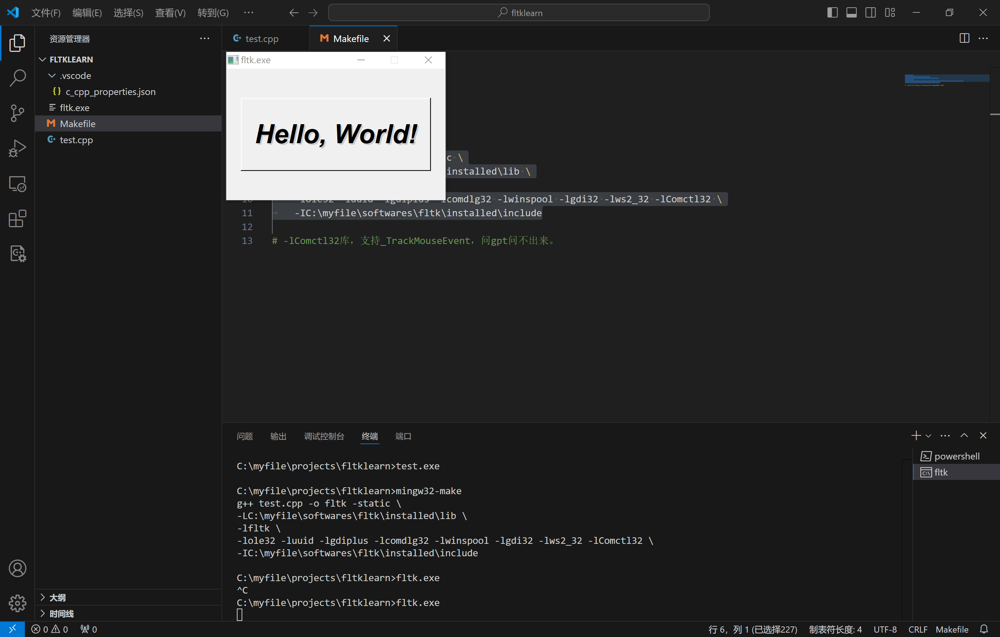

# fltk

## ubuntu

+ 官网下载源码

    https://www.fltk.org/software.php

+ 解压文件

    `tar -xvf fltk .tar.gz`

+ 编译

    `./configure --enable-debug --enable-shared --enable-threads --enable-xdbe --enable-xft`

+ 安装

    `sudo make install`

## windows
### 安装mingw64
[mingw教程](../mingw/mingw.html)
### 安装cmake
略~
### 安装fltk
+ 1，下载源码
+ 2，启动cmake-gui，也可以直接CLI configure，配置选择源码路径以及make生成路径
<div style="text-align:center;"></div>
+ 3，点configure配置mingw编译器，只用gcc和g++，配置安装路径
+ 4，点generate生成makefile
+ 5，进入make生成路径文件夹，执行mingw32-make install

### 使用
示例代码test.cpp
```c++
#include <FL/Fl.H>
#include <FL/Fl_Window.H>
#include <FL/Fl_Box.H>

int main(int argc, char **argv)
{
  Fl_Window *window = new Fl_Window(300,180);
  Fl_Box *box = new Fl_Box(20,40,260,100,"Hello, World!");
  box->box(FL_UP_BOX);
  box->labelsize(36);
  box->labelfont(FL_BOLD+FL_ITALIC);
  box->labeltype(FL_SHADOW_LABEL);
  window->end();
  window->show(argc, argv);
  return Fl::run();
}
```
makefile文件
```makefile
all:test.cpp
	g++ test.cpp -o fltk -static \
	-LC:\myfile\softwares\fltk\installed\lib \
	-lfltk \
	-lole32 -luuid -lgdiplus -lcomdlg32 -lwinspool -lgdi32 -lws2_32 -lComctl32 \
	-IC:\myfile\softwares\fltk\installed\include
```
后边儿一大堆库是mingw带的系统库，写一般程序用不到，gui库是这样的，乐。

**注意到那个Comctl32，没有的话会报错，报的错问gpt会让你添加user32，没卵用，那个库是在微软官网找到的。**

执行`mingw32-make`编译得到fltk可执行文件，执行效果如下：
<div style="text-align:center;"></div>

### 在blkrv中使用
blkrv仅支持在linux上运行，fltk用于模拟显示器，因此，如果需要显示图形化内容，请使用`make clean && make ENABLE_GPU=1`以开启图形化显示。