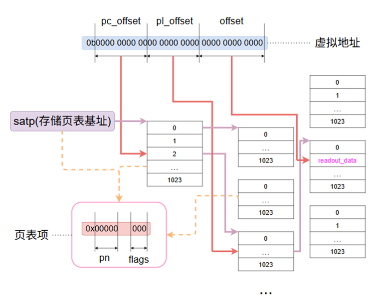

# MMU

## 工作流程

+ 启动

    当satp寄存器值低12位不为零

+ 工作

    1，检查tlb快表

    2，如果命中则直接返回物理地址。

    3，如果未命中则经过如下流程进行虚拟地址转换

    

+ 未命中

    此处功能可扩展

    当前对于未命中的处理为：
    
    1，如果tlb一级快表已满，则删除快表第一项，新表项插入末尾

    2，如果未满，则插入末尾