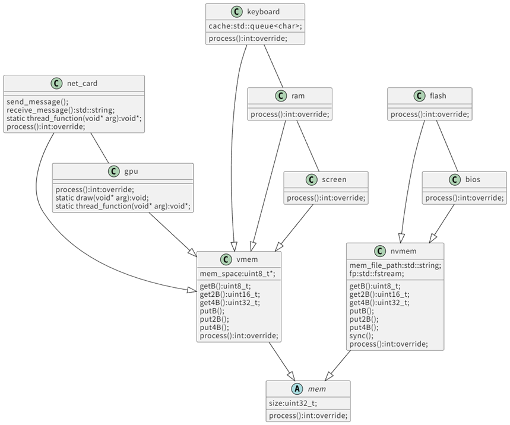

# 外设

## 虚拟抽象

## 协议

所有的外设均是经过简化的设备，对于现实设备不具备参考价值，我们自定义了大量的控制寄存器与数据寄存器等。

+ bios

    - 说明
        
        pc寄存器初始为0，程序将从bios的0地址开始执行。

    - 地址空间

        0x00000000-0x00100000

+ ram

    - 说明

        可扩展内存控制器，需要注意某些耦合设备实现，例如ram等。

    - 地址空间

        0x00100000-0x10100000

+ keyboard

    - 地址空间

        0x10100000-0x10200000

    - driver

        键盘按下时产生中断，0x10100000地址处将会存储三个字符缓存。

+ screen（字符输出设备）

    - 地址空间

        0x10200000-0x20200000

    - driver

        0x10200003写入1时触发输出，screen设备将会将0x10200004后的字符输出到宿主机终端。

+ gpu

    - 说明

        gpu设备并不具备通用并行计算能力，但是可以扩展，绘图功能被限制，也可以扩展

        该设备贴图时为了性能需求，将会直接从flash读取文件内容，这与文件系统强绑定。

    - 地址空间

        0x20200000-0x30200000

    - driver

        0x20200000为控制寄存器地址

|写入信号|对应功能|数据寄存器功能与地址偏移|
|---|---|---|
|1|绘制文字|4:x;8:y;12:r;16:g;20:b;24:font_size|
|2|绘制三角形|4:x0;8:y0;12:x1;16:y1;20:x2;24:y2;28:r;32:g;36:b|
|3|刷新屏幕||
|4|绘制jpg|4:x;8:y;12:image_file_size;16:inode_id|
|5|绘制png|4:x;8:y;12:image_file_size;16:inode_id|

+ nic

    - 说明

        该设备可以理解为对socket的简化封装，也可以自己实现完整的计算机网络体系结构内容得到更高的网络带宽。

        nic设备采用dma，直接操作ram。

    - 地址空间

        0x30200000-0x40200000

    - drivers

        0x30200000为控制寄存器地址

|写入信号|对应功能|数据寄存器功能与地址偏移|
|---|---|---|
|1|accept|0-16:ip;20:port;24:protocol;28:return sockfd|
|2|send|4:sockfd;8:send_data_ram_addr;12:data_len|
|3|recv|4:sockfd;8:send_data_ram_addr;12:data_len|
|4|connect|0-16:ip;20:port;24:protocol;28:return sockfd|
|5|close|4:sockfd|

+ flash

    - 地址空间

        0x40200000-0x60200000

+ pmc

    - 地址空间

        0x60200000-0x60300000

    - driver

        0x60200000为控制寄存器，向该地址写入任何信号都会触发关机。

+ monitor

    - 地址空间

        0x60300000-0x60400000

    - drivers

        0x60300000为控制寄存器地址
        
        当向控制寄存器地址写入1时触发监测器的启动，此时开始进行性能数据的采集。

        写入1后写入0，将会触发监测器的关闭，并将数据存储至宿主机。