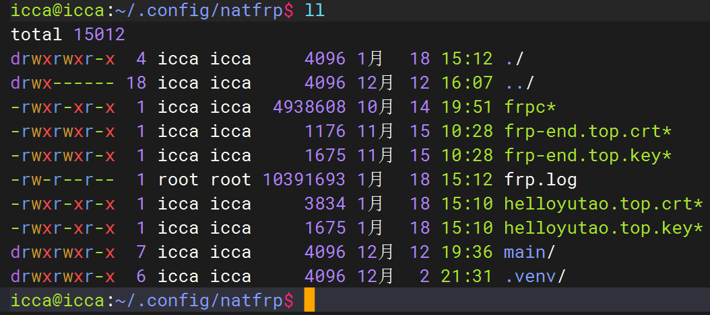

> # frp穿透

>借助sakura frp建立内网穿透

## 内网穿透浅析

现在假设我们在电脑上建立http server进程，该进程绑定到2345端口。

那么我们如果想让外部设备访问该服务，要么将电脑置于公网上，也就是获取一个公网ip。

要么借助中间人，让外部设备通过中间人访问，也就是内网穿透技术，我更愿意将之称为代理（proxy）的一种。

原理如下：

显而易见，当外部设备访问外网服务器的ip:port，例如101.70.105.150:4598时，该服务器上运行的frps程序将接受你所有的请求，并将该请求转发给你的局域网机器（公网机器能给局域网转发是因为局域网机器主动与公网机器建立了长连接），局域网机器获取请求返回响应，公网机器将响应返回给请求者。

## sakura frp

### 建立通道

进入[sakura](https://www.natfrp.com/user/)官网,注册并认证。

点击`服务`->`隧道列表`->`创建隧道`

到这一步所看见的列表就是能选择的公网机器列表。

一般选tcp或者udp协议，前者更常用（建网站），后者主要用于游戏服务器的搭建。

最重要的就是本地端口的选择，也就是填你在局域网机器建立的服务绑定的端口，以这里的例子，也就是2345。然后点击完成。

点击`服务`->`软件下载`->`frpc`->选择架构->`下载`

将下载到的二进制文件放到我们建立服务的局域网服务器。

在以上图中复制参数，并在局域网服务器上运行

`./frpc -f 你复制的参数`

当打印出公网ip，那么穿透成功。

## 域名上网

### 申请域名

### 域名备案

### ssl证书

1,华为云买一个免费的，选最后一个类型，供应商选di

2，添加记录集，类型TXT验证

3，将证书下载到frp工作目录，frp的证书放在哪里，你就把新证书放在哪里，证书的前缀由域名决定。

4，frp的工作目录由执行路径决定，或者由service的workingDirectory决定：

5，完成更换后直接重启frp服务即可