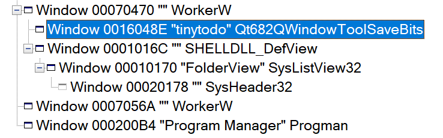

# pyside6 开发

## 安装

`pip install pyside6`

## 打开pyside-designer

`pyside6-designer`

## ui转python代码

`pyside6-uic untitled.ui > widget.py`

## 实例化ui

```python
class MainWindow(QMainWindow):
    def __init__(self):
        super(MainWindow, self).__init__()

        # 创建 UI 实例并设置到当前窗口
        self.ui = Ui_MainWindow()#这个Ui_MainWindow就是我们创建的ui
        self.ui.setupUi(self)
        
        # 添加自定义逻辑
        self.ui.pushButton.clicked.connect(self.on_button_clicked)

    def on_button_clicked(self):
        print("按钮被点击了！")
if __name__=="__main__":
    app=QApplication(sys.argv)

    mainWindow=MainWindow()

    mainWindow.show()

    app.exec()
```

## 创建托盘(创建菜单)

```python
# 创建系统托盘图标
self.tray_icon = QSystemTrayIcon(self)
self.tray_icon.setIcon(QIcon("icon.png"))  # 设置托盘图标，替换为你的图标路径

# 创建托盘菜单
self.tray_menu = QMenu()

# 添加显示窗口选项
show_action = QAction("Show Window", self)
show_action.triggered.connect(self.show_window)
self.tray_menu.addAction(show_action)

# 添加退出选项
exit_action = QAction("Exit", self)
exit_action.triggered.connect(self.close_application)
self.tray_menu.addAction(exit_action)

# 将菜单绑定到托盘图标
self.tray_icon.setContextMenu(self.tray_menu)

# 显示托盘图标
self.tray_icon.show()
```

## 窗口属性

+ 窗口置底

```python
self.setWindowFlags(Qt.WindowStaysOnBottomHint)
```

+ 窗口无边框化

```python
self.setWindowFlags(Qt.FramelessWindowHint)
```
+ 隐藏任务栏图标

```python
self.setWindowFlags(Qt.Tool)
```

## 动态插入子部件
```python
new_todo=Todo(self)
new_todo.setText(text)
self.ui.lineEdit.clear()
self.ui.scrollVLayout.insertWidget(1,new_todo)
```
## 背景窗口圆角

```python
def paintEvent(self, event):
        # 创建一个 QPainter 对象并指定绘制设备为当前窗口
        painter = QPainter(self)
        # 设置绘制选项为反锯齿，使绘制的图形边缘更加平滑
        painter.setRenderHint(QPainter.RenderHint.Antialiasing)
        # 设置画刷颜色为白色
        painter.setBrush(QBrush(QColor(255, 255, 255)))
        # 设置画笔颜色为透明，即不绘制边框线
        painter.setPen(Qt.GlobalColor.transparent)
        # 获取当前窗口的矩形区域
        rect = self.rect()
        # 绘制圆角矩形，圆角半径为 15
        painter.drawRoundedRect(rect, 15, 15)
        """ 通过遮罩设置窗口为圆角矩形 """
        path = QPainterPath()
        rect = QRect(0, 0, self.width(), self.height())
        radius = 15  # 圆角半径
        path.addRoundedRect(rect, radius, radius)
        # 使用 QRegion 进行裁剪
        region = QRegion(path.toFillPolygon().toPolygon())
        self.setMask(region)
```
不设置遮罩将会出现四个黑角，反正通用框架基于系统的窗口管理器必定出现许多问题
## QCharts

太杂了，不太好说

## QSS

```css
QPushButton {
    background-color: #4CAF50;  /* 设置按钮背景颜色 */
    color: white;  /* 设置按钮文本颜色 */
    border: none;
    padding: 5px 10px;
}
QPushButton:hover {
    background-color: #45a049;  /* 设置按钮悬停时的背景颜色 */
}
```

## 弹出输入框

```python
# 创建一个 QInputDialog
        input_dialog = QInputDialog(self)
        input_dialog.setWindowTitle("修改文本")
        input_dialog.setLabelText("请输入新的文本：")
        input_dialog.setTextValue(self.text())  # 设置默认值为当前文本
        # 显示对话框并获取用户输入
        if input_dialog.exec() == QInputDialog.Accepted:
            new_text = input_dialog.textValue()
            if new_text:
                self.setText(new_text)
```

## 本文设置删除线

```python
def setStrike(self,ifstrikeout:bool):
    font = self.font()
    font.setStrikeOut(ifstrikeout)  # 移除删除线
    self.setFont(font)
```

## 将窗口嵌入桌面

```python
def set_desktop_window(self):
    # 获取桌面窗口的句柄
    hwnd = ctypes.windll.user32.FindWindowW("Progman", "Program Manager")
    if hwnd:
        # print("setdesktopparent")
        # 获取当前窗口的句柄
        win_hwnd = self.window.winId()
        # 将当前窗口设置为桌面窗口的子窗口
        ctypes.windll.user32.SetParent(win_hwnd, hwnd)
```

需要注意的是，嵌入桌面后，如果使用setStyleSheet("background: transparent;")，背景将会变为纯黑（windows，预估是windows窗口管理器搞的鬼）

如果setAttribute(Qt.WA_TranslucentBackground),窗口上的空间将不再发生变化（难蚌）

解决！！！
```python
查找到program manager窗口的句柄
progman_hwnd = ctypes.windll.user32.FindWindowW("Progman", "Program Manager")
if not progman_hwnd:
    print("Failed to find Progman window")
    return
# 2. 发送 0x52C 消息，触发桌面窗口重新排列
ctypes.windll.user32.SendMessageW(progman_hwnd, 0x52C, 0, 0)
# 3. 查找 WorkerW 窗口
self.workerw_hwnd = ctypes.c_int(0)

def enum_windows_callback(hwnd, lParam):
    # 查找 WorkerW 窗口
    if ctypes.windll.user32.FindWindowExW(hwnd, None, "SHELLDLL_DefView", None):
        # self.workerw_hwnd = ctypes.windll.user32.FindWindowExW(None, hwnd, "WorkerW", None)
        self.workerw_hwnd=hwnd
    return True
# 将 Python 回调函数转换为 C 回调函数
# 定义回调函数类型
WNDENUMPROC = ctypes.WINFUNCTYPE(ctypes.c_bool, ctypes.POINTER(ctypes.c_int), ctypes.POINTER(ctypes.c_int))
enum_windows_proc = WNDENUMPROC(enum_windows_callback)
# 枚举所有窗口
ctypes.windll.user32.EnumWindows(enum_windows_proc, 0)
if not self.workerw_hwnd:
    print("Failed to find WorkerW window")
    return
# 4. 将当前窗口设置为 WorkerW 的子窗口
win_hwnd = self.window.winId()
ctypes.windll.user32.SetParent(win_hwnd, self.workerw_hwnd)
# 5. 确保窗口可见
ctypes.windll.user32.ShowWindow(win_hwnd, 1)  # SW_SHOWNORMAL
```

最根本的问题在于，有部分设备的program manager与worker是分离的，其中一个worker是管理桌面图标的，另一个worker是透明背景，而program manager是桌面总窗口。

如下的spy视图



我们之前是将我们的窗口加入program manager，这会造成worker的层级在我们窗口之上，我们的就被挡住了，现在我们先向program manager发送0x52c将program manager拆出workerw，此时将我们的窗口作为workerw的子窗口，注意，需要时包含shelldlldelview的workerw，否则也会被遮挡。如果想做桌面壁纸，那就将窗口作为另一个worker的子窗口。添柴！

