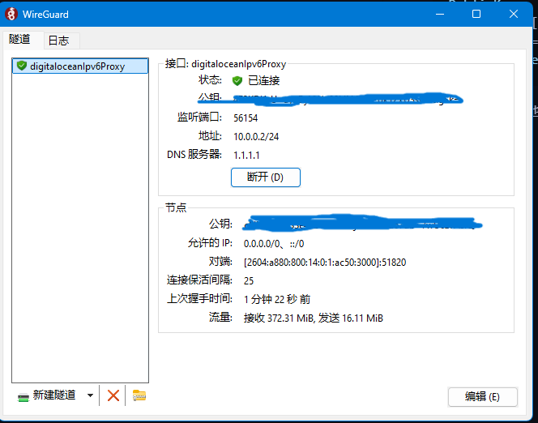

# 服务器转ipv6流量

## 买一台服务器

强烈建议digitalocean，一个月六美元

创建水滴时记得打开ipv6

## 服务器上工作

### 安装wireguard

`apt install -y wireguard iptables`

### 生成密钥

`wg genkey | tee server_private.key | wg pubkey > server_public.key`

`wg genkey | tee client_private.key | wg pubkey > client_public.key`

### 编辑/etc/wireguard/wg0.conf

填写以下内容：

```ini
[Interface]
Address = 10.0.0.1/24   # WireGuard 内网 IPv4
ListenPort = 51820
PrivateKey = [server_private.key]

# 开启转发
PostUp   = sysctl -w net.ipv4.ip_forward=1 net.ipv6.conf.all.forwarding=1
PostUp   = iptables -t nat -A POSTROUTING -o eth0 -j MASQUERADE
PostDown = iptables -t nat -D POSTROUTING -o eth0 -j MASQUERADE

[Peer]
# 客户端配置
PublicKey = [client_public.key]
AllowedIPs = 10.0.0.2/32
```

启动服务

`systemctl enable wg-quick@wg0 --now`

### 客户端下载[wireguard](https://zh-wireguard.com/install/)

客户端配置以下内容

```ini
[Interface]
Address = 10.0.0.2/24
PrivateKey = [client_private.key]
DNS = 1.1.1.1

[Peer]
PublicKey = [server_public.key]
Endpoint = [你的VPS IPv6地址]:51820
AllowedIPs = 0.0.0.0/0, ::/0
PersistentKeepalive = 25
```

ipv6地址填写的地方需要有方括号[]

点击连接：



得到如上即可