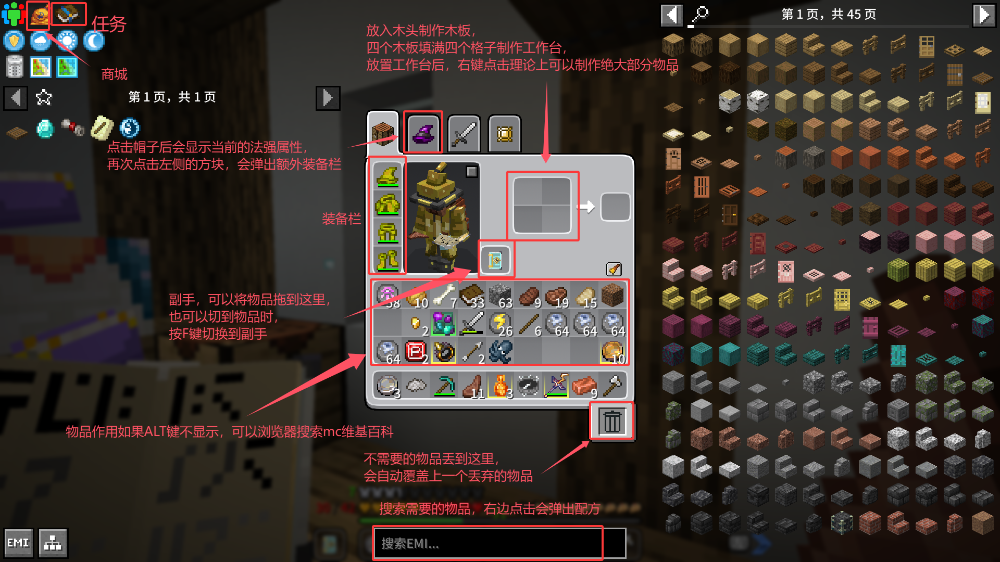
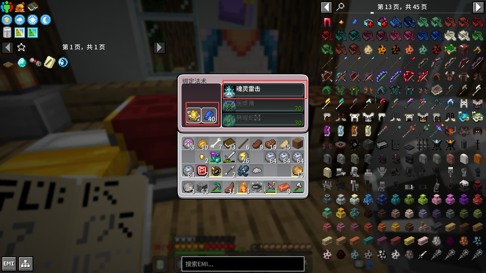
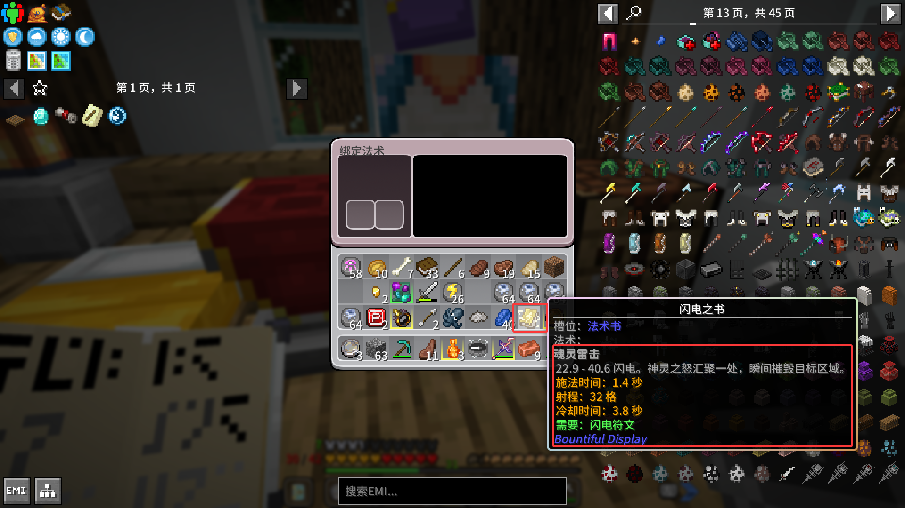
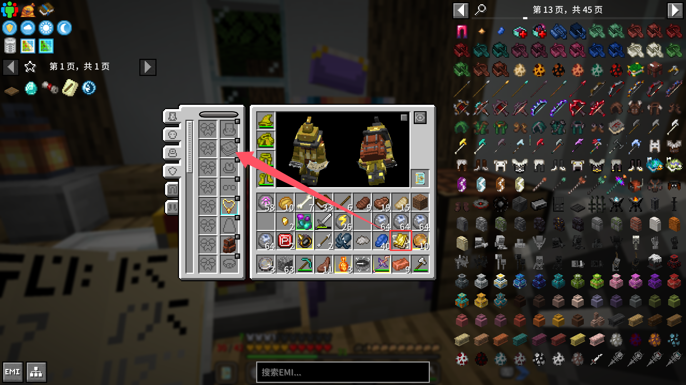
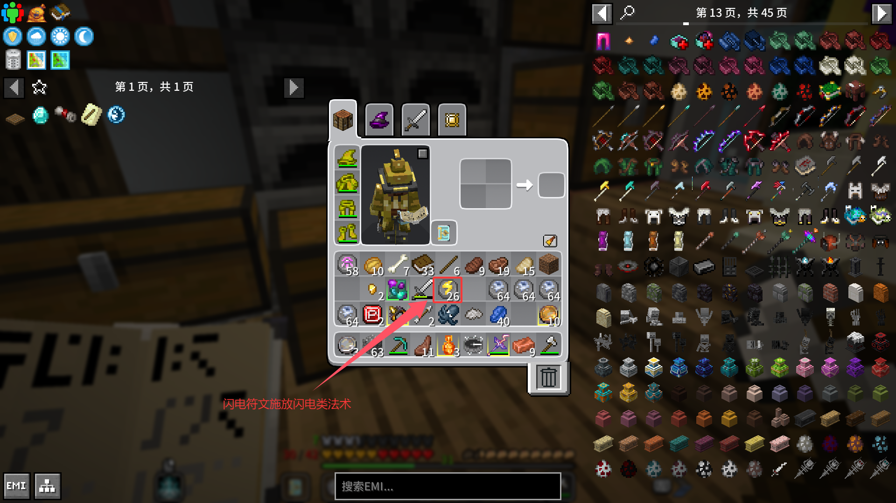

# 成为大魔法师！

## 基础知识（必读）

进游戏后按E键打开该界面

工作台：

根据上面流程放置工作台后，通过以下流程生成物品

tip1：`可以通过滑轮快速切换物品`

minecraft中所有的物品可以简要分为几类：建筑方块、功能方块，材料、装饰、植物、工具

+ 建筑方块：可以用于建造，仅有堆叠功能，提供建筑的基础材料，通过不同建筑方块搭建美观的建筑。可以通过材料进行合成，或者直接挖掘获得

+ 功能方块：这些方块可以用来放置，当右键点击他们时，会触发不同的功能，例如箱子可以放置物品，床可以睡觉，工作台合成物品等。

+ 材料：这类物品不可放置，但可以通过工作台合成不同的物品

+ 装饰：这类物品可以放置，但唯一的作用仅用来装饰

+ 植物：植物分为本体和种子，基本遵循自然规律，例如土豆、小麦的种子是他本身，而南瓜等作物的种子需要特殊方式获取。

+ 工具：通过材料合成，具有攻击，功能性等作用，例如剑左键可以进行攻击，由木头剑，石剑，铁剑，钻石剑品阶依次增高。而其他工具例如锄头，右键点击草方块可以进行锄地以进行种植。挖掘石头等使用镐子效率更高，而木头等使用斧头效率更高。

元素觉醒整合包新增了部分其他物品，这里简要介绍重要的部分：

+ 法术类：包括法杖、法术书等，对应的法术物品可以增强相应的属性。

+ 装备类：整合包提供了种类繁多的装备，同样可以增加对应的属性。

+ 召唤，传送类：例如召唤珍珠可以召唤一个传送门，将会传送怪物到周围；地图方块，通过领域地图右键点击可以传送到对应的副本地图。

tip2：`完成第一章的伐木任务后会获得一个大背包，按B键可以打开背包空间，需要注意该空间无法外部直接访问，例如货币放置在该空间时，无法在商店购买物品，需要放置到外部背包`

## 关于法术

### 获取一个法术

首先右键点击`法术绑定台`，将一本书放置到左边，右边选取对应职业的法术书进行生成获取法术书。

再将法术书放到法术绑定台，再放入青金石绑定对应的法术。

此时鼠标放在法术书上，按ALT键将会看到法术书绑定的法术

打开个人界面，点击如下按钮打开装备界面，

将法术书放置到槽位

切换到武器，此时可以施放已绑定的法术，通过法术书绑定的法术只要是攻击性武器都可施放，但是法杖类武器具有相应的加成。

想要施放法术还需要对应的符文，符文制作可以使用工作台或者符文制作台，后者能产出更多的符文。将符文放置到背包格子即可。

### 其他施放方式

+ 切换到卷轴施放，例如火球术卷轴施放

+ 法杖自带法术施放，例如闪电法杖自带`魂灵雷击`法术。

### 主线

打开任务界面，鼠标移到左侧三角形，完成对应的主线任务即可推进，同时获取整合包绝大部分的知识。

