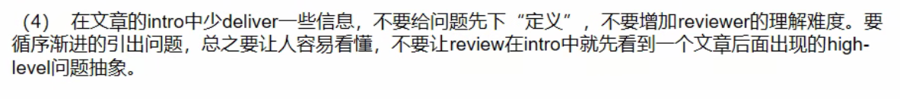

# 论文写作注意

## 重视写作

给别人讲明白自己的idea

## 英文写作

英文论文阅读

减少辅助工具的使用

领域内专有名字，深度绑定第一个问题。

## 观点

和图配合，论述清楚自己的观点。

缩写等先定义再使用，不要默认审稿人知道相关领域知识。

## 用词准确

用词不标准，cache ratio，cache rate

用词不形象，动词的选择等。

## 画图不严谨

缺少信息

图中重点表达模糊

## 详略不当

没有一个凝练的写作思路，没有大纲。论文中出现的每一段最好都有意义。

强调为什么要这么做，比啰啰嗦嗦讲怎么做更重要。

## 矢量图

放大不失真

字体统一，格式相关问题。

文章时态位一般现在时

